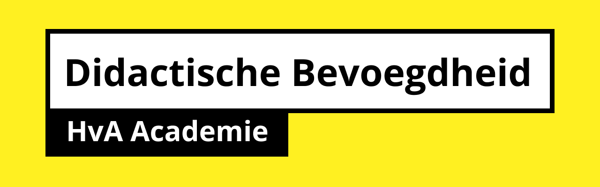

# Basiskwalificatie Didactische Bekwaamheid (BDB)

Een stevige basis op het gebied van didactiek ondersteunt je bij het ontwerpen en uitvoeren van onderwijs en het begeleiden van studenten. Het BDB-traject biedt je de mogelijkheid de competenties van een hbo-docent op minimaal basisniveau te ontwikkelen.

Elke docent aan de HvA is na een periode in dienst verplicht tot het halen van een basiskwalificatie didactische bekwaamheid (BDB). Dit programma heb ik het afgelopen semester doorlopen en met een ruime voldoende afgerond.

Deze repository bevat ongeveer alles wat ik gedurende de BDB aan opdrachten en assessments heb gedaan.

→ [Bekijk website](https://dandevri.github.io/bdb/)

> Het kan zijn dat er persoonlijke info (ook van studenten) in de teksten staat. Neem contact met me op als je dat niet wilt, dan haal ik het weg.

- Cursus: BDB
- Docent: Danny de Vries (@dandevri)
- Jaar: 2019-2020
- Universeit: Hogeschool van Amsterdam
- Opleiding: Communication and Multimedia Design (voltijd CROHO: 34092)
- Faculteit: Digital Media and Creative Industries
- Taal: Nederlands
- Leergroep: De Zwarte Piste

GNU General Public License v3.0, docs and images are CC-BY-4.0.
