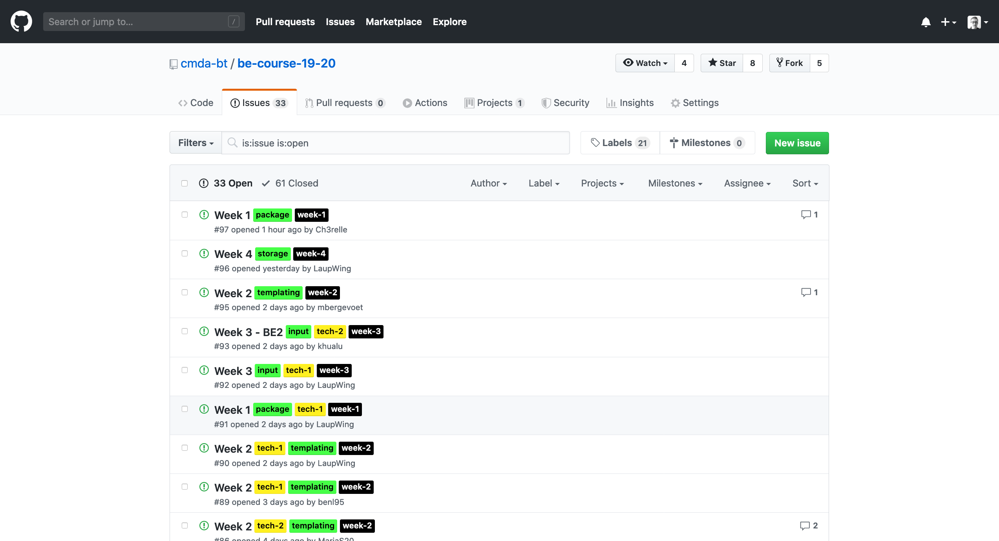
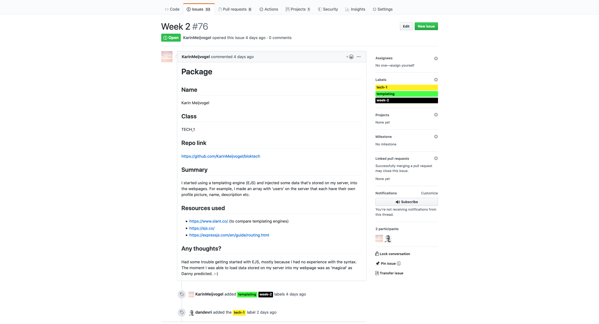
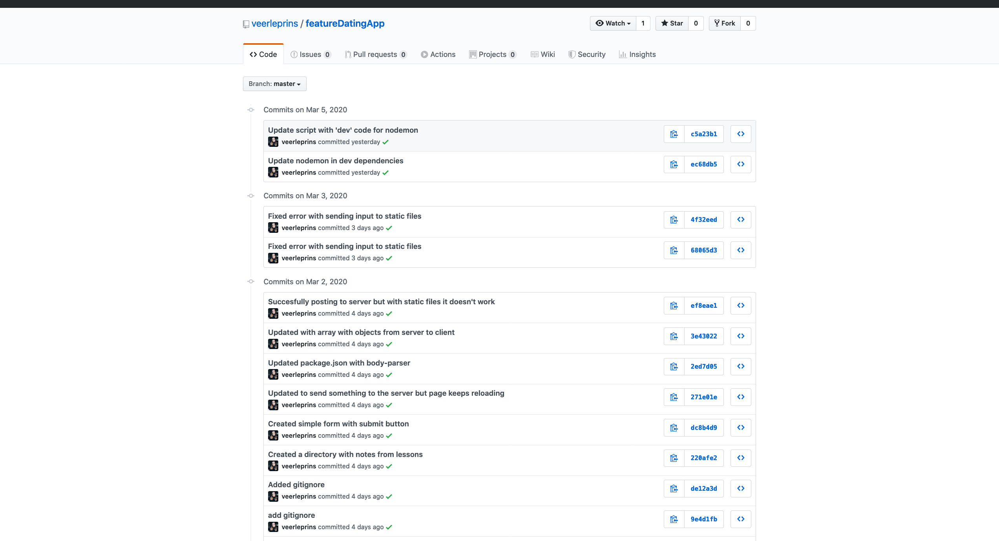
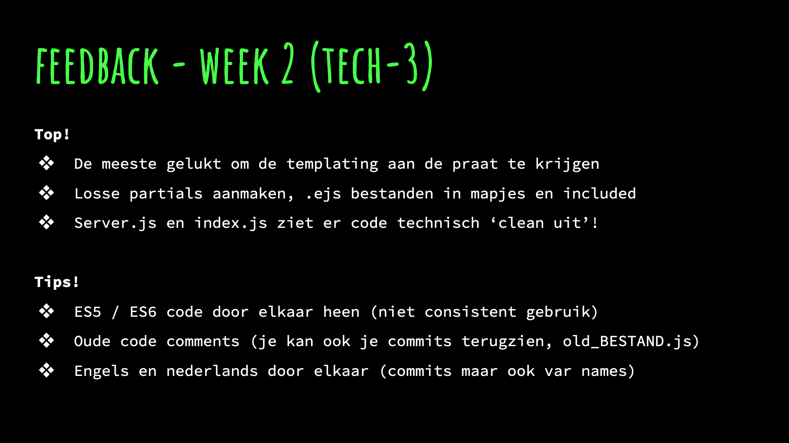
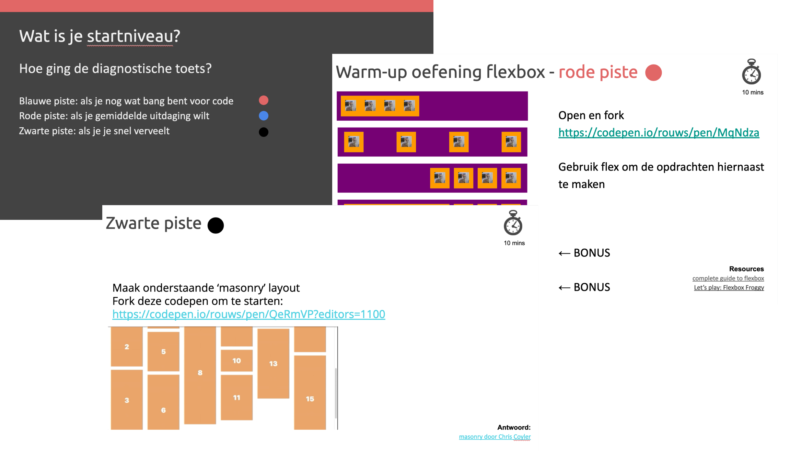
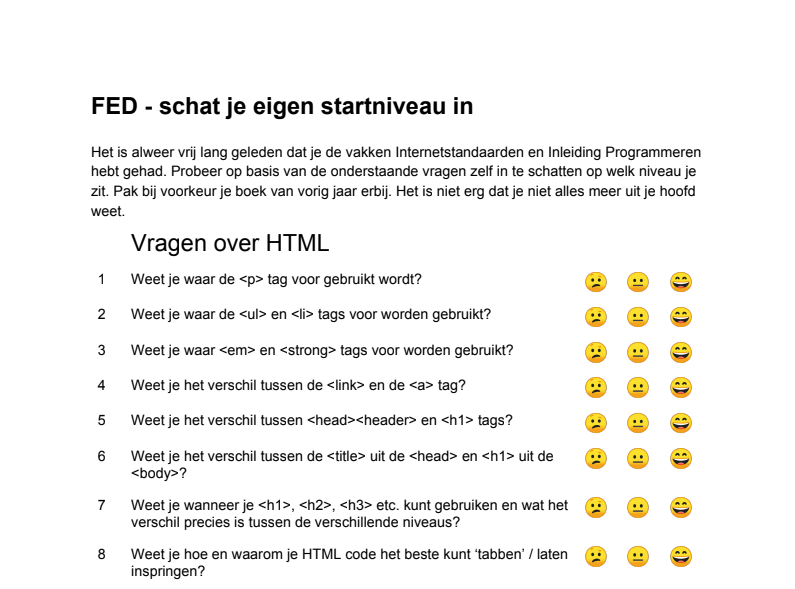
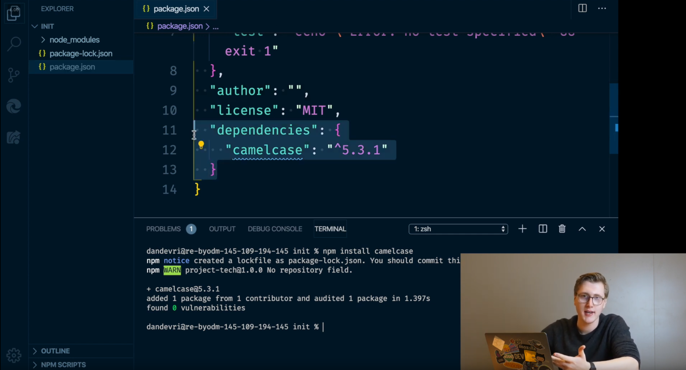
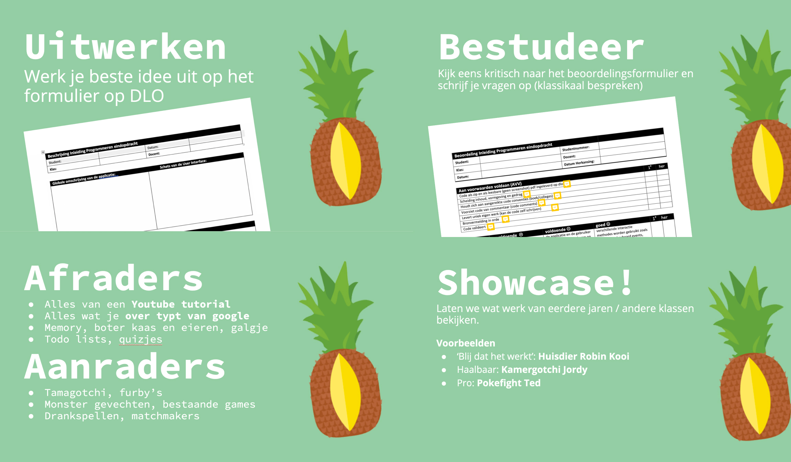
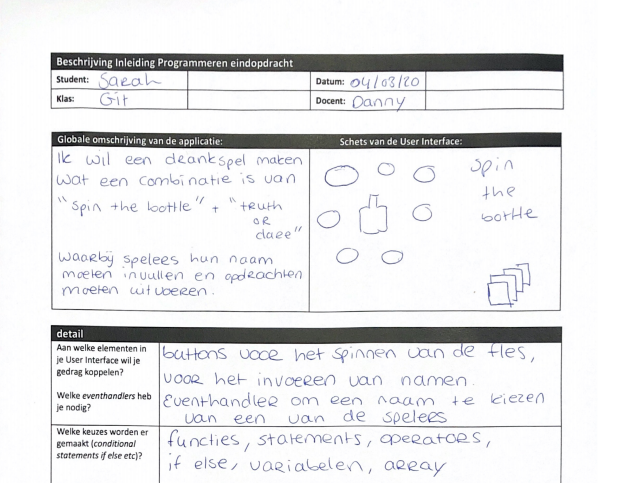
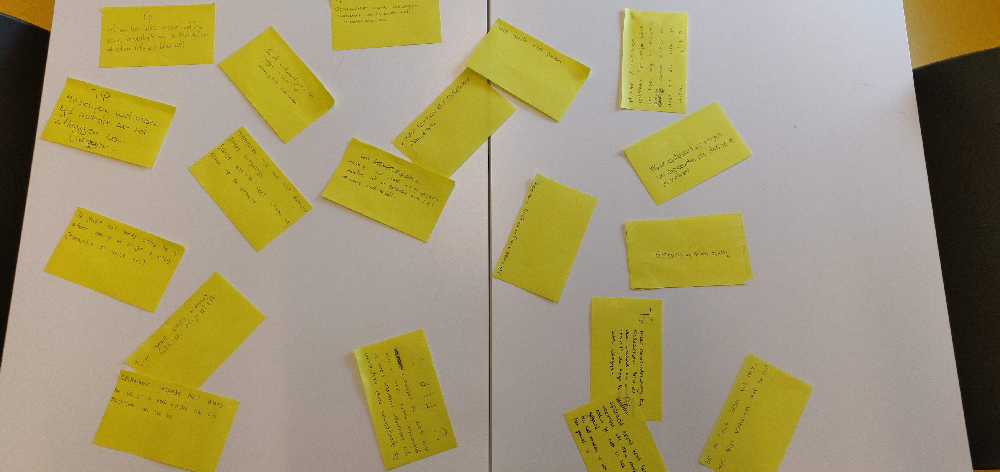

# Assessment - Thema-1

## Metadata
* Cursus: Basiskwalificatie Didactische Bekwaamheid (BDB)
* Docent: Danny de Vries (Docent Webtechnologie)
* Jaar: Feb - Jun 2020
* Universeit: Hogeschool van Amsterdam (HvA Academie)
* Opleiding: Communication and Multimedia Design (voltijd CROHO: 34092)
* Faculteit: Digital Media and Creative Industries
* Leergroep: De Zwarte Piste

## Inhoudsopgave
* [Opdracht](#opdracht)
* [Leervraag 1](#leervraag-1)
* [Leervraag 2](#leervraag-2)
* [Leervraag 3](#leervraag-2)
* [Feedback](#feedback)
* [Bronnen](#bronnen)
* [Bijlage](#bijlagen)

## Opdracht

### Thema
Het doel van dit thema is om jouw studenten te motiveren en inspireren. Vragen die centraal staan zijn: hoe krijg jij studenten in beweging? Wat werkt? Wat niet? Wie is jouw student eigenlijk?

### Assessment
Om het thema af te ronden werken we binnen de BDB met Peer Assessments, een toetsvorm waarbij het werk wordt beoordeeld en van feedback wordt voorzien door de leergroep. Het laat zien dat je voldoet aan de criteria en je levert daarvoor bewijslast. Daarnaast reflecteer je op je ontwikkeling.

### Criteria

1. Je draagt bij aan de ontwikkeling van jouw studenten vanuit jouw kwaliteiten als docent
2. Je weet wie je studenten zijn: wat heeft hij of zij nodig om te kunnen leren en ontwikkelen? (diversiteit) en je gebruikt hiervoor het artikel van Paul van den Bos.
3. Je kunt je onderwijs afstemmen op jouw individuele studenten (differentiëren).
4. Je kunt de leersituatie aansluiten op het beginniveau en de belevingswereld van je studenten.
5. Je kunt eigen inbreng van je studenten bewust inzetten: je kunt laten zien dat studenten in jouw onderwijs actief aan de slag zijn zodat ze zelf regie nemen over hun eigen leren.

### Leervragen
Voor aanvang van de leergroep had ik een stuk of 7 leervragen bedacht en de feedback van de leergroep was dan ook dat dit er teveel waren. Er waren een aantal leervragen die te combineren waren. Uiteindelijk heb ik het teruggebracht tot drie stuks en die gekoppeld aan de drie basisbehoefte (relatie, cognitie en autonomie) uit de *self-determination theory (SDT)* van Deci en Ryan.

## Leervraag 1 - Cognitie

> Hoe kan ik studenten motiveren door hun eigen voortgang zichtbaar te maken? (cognitie)

*Ik merk dat studenten over het algemeen kijken naar wat ze nog moeten doen en denken ‘wat veel werken’. Technische vakken zijn vaak veel nieuwe stof en soms vergeten ze wel eens wat ze in een hele korte tijd al geleerd en gedaan hebben.* 

### Waar stond ik?
Een vak is meetal 'maar' 10 weken en je wilt dat studenten in een flow komen. Door studenten vaker formatief feedback te geven en dat terug te koppelen in de lessen maken studenten iteraties op hun opdrachten. Formatief feedback geven en dat in de les behandelen doe ik in sommige lessen nu te weinig.

### Bewijsmateriaal

#### Weekopzet vak
Voor het vak 'back-end' ben ik van een thema opzet naar een week opzet gegaan. Studenten behandelen elke week een thema en kunnen dat afronden door een zogeheten 'issue' aan te maken waardoor ze die week als compleet markeren.
* Als studenten geen issue heeft aangemaakt is dat voor mij reden om meer aandacht te besteden aan deze student in de les
* Studenten kunnen zelf terug gaan naar hun eigen issues en zien of ze achterlopen

*Een voorbeeld van issues die studenten kunnen aanmaken per week*

*In zo'n issue zetten studenten een samenvatting neer van wat ze hebben gedaan en reflecteren hier kort op*

Studenten leveren hun werk niet in Brighspace in maar op GitHub. In GitHub kun je 'snapshots' maken van code. Door elke keer een commit te maken ze een stap naar hun eindopdracht. Die commits zijn publiek en ik maar ook de docent kan deze terugzien.

*'Snapshots' van een student waarin ze terug kunnen gaan naar vorige versies*

#### Terugkoppeling slides
Aan het eind van de week ga ik door de issues van mijn klas heen en schrijf ik op wat er goed gaat en wat er beter kan. Dit verwerk ik dan in de slides van de week erop en de studenten kunnen deze feedback dan verwerken. Wat hier ook krachtig aan is dat we het klassikaal bespreken en we de fouten van meerdere individueen met elkaar combineren.

*Terugkoppeling met tips en tops in de slides*

### Waar sta ik nu?

Met bovenstaande bewijslast en leervraag toon ik aan te voldoen aan **criteria 5 en criteria 1**. Studenten krijgen inzicht in hun eigen voortgang zodat ze *de regie nemen over het eigen leren* en door terugkoppeling van de feedback bevordelijk ik *de ontwikkeling van de studenten* door als 'expert' de opdrachten te reviewen.

## Leervraag 2 - Relatie
> Hoe kan ik studenten motiveren om lesstof aan te bieden op hun eigen niveau? (relatie)

*Het is voor beginnende studenten heel demotiverend om meteen met moeilijke stof aan de slag te gaan maar je wilt ook de wat gevorderde pushen om de uitdaging op te zoeken.*

### Waar stond ik?
Voor technische vakken is het best lastig om bronnen te vinden die 'one-side fits all zijn'. Het niveau verschil bij een vak is heel erg groot, sommige studenten hebben helemaal geen programmeer ervaring en andere hebben al een MBO opleiding afgerond in die richting. Sommige studenten willen 'jip en janneke' artikelen terwijl de andere student juist behoefte heeft aan meer verdiepende stof.

### Bewijsmateriaal

#### Pistes
Bij het vak front-end in het tweedejaar maakte we gebruik van 'pistes'. Studenten doen een diagnostische toets (met vakinhoudelijke vragen) en schatten op basis daarvan hun eigen niveau in. Op basis daarvan behoren ze tot een piste: blauw = beginneling, rood = gemiddeld en zwart = gevorderde. Dit principe ben ik ook gaan toepassen bij inleiding programmeren in de propedeuse.

* Voor de blauwe piste maakte ik vaak een aparte tafel om onderwerp uit de les extra uit te leggen, de rest van de studenten kon aan de slag met de opdrachten
* Als de mensen uit de rode piste 'snel' klaar waren met de opdrachten kon ik ze aansporen om te proberen aan de slag te gaan met de opdracht uit de zwarte piste. Vaak stonden ze dan versteld over dat ze die opdracht ook konden maken

*Slides uit de les front-end met kleurcodes voor het niveau van de opdrachten*

*Voorbeeld van een diagnostische toets voor de les front-end*

#### Live demo's

Uit de feedback van de studenten bleek dat ze veelal behoefte hadden aan 'live coding' en niet alleen maar slides. Dus soms m'n text editor openen en dingen voordoen. Vooral bij back-end waren er aardig wat slides en die ben ik steeds meer gaan schrappen en in plaats daarvan demo's gaan geven. 

Van onderwerpen uit de slides die vaak terugkomen of belangrijk zijn heb ik video's gemaakt die op Youtube staan. Ook daar komen de live demo's weer terug. Studenten kunnen op hun eigen gemak video's terugkijken.

*Screenshot van een video back-end die op [Youtube staat](https://www.youtube.com/watch?v=tdqXTNqNrr0)*

### Waar sta ik nu?
Met bovenstaande bewijslast en leervraag toon ik aan te voldoen aan **criteria 2 en criteria 3**. Door de studenten zelf hun eigen niveau in te laten schatten kan weet ik wat de *student nodig heeft om te kunnen leren* en kan ik de stof *afstemmen op individuele studenten (differentiëren)*

## Leervraag 3 - Autonomie

> Hoe kan ik studenten motiveren door ze zelf invulling te laten geven aan een eindopdracht? (autonomie)

*Techniek is veel leuker als je aan een opdracht kan werken waar je zelf graag aan wilt werken in plaats van fictieve opdrachten die vanuit het vak komen.*

## Waar stond ik?

Als ik terugkijk naar mijn studententijd waren mijn beste opdrachten de opdrachten waar ik de vrijheid kreeg om een eigen idee uit te werken. Daarnaast begreep ik het concept van 'verplichte tussenopdrachten' zelf nooit zo goed. Ik wou tijdens het vak altijd steeds kleine stappen maken naar een eindopdracht en niet verplichte opdrachtjes maken en die inleveren.

### Bewijsmateriaal

### Eindopdracht
Bij het vak inleiding programmeren sluiten studenten het vak af met een product (mondeling) waarbij ze zelf een concept mogen verzinnen om daar een applicatie van te schrijven. Tijdens de lessen is het dus vooral voor mij belangrijk om de studenten bij te sturen met hun concept, daar feedback op te geven en desnoods in complexiteit aanvoeren.

* Ik vertel de studenten af en aanraders van wat goede eindopdrachten zijn en veel voorkomende fouten van mensen die het mondeling niet halen.
* Ik laat een aantal praktijkvoorbeelden zien maar showcase ook het werk van voorgaande jaren

*Slides uit een les inleiding programmeren waar klassikaal ideeën voor de eindopdracht bespreken*

*Foto van een formulier waarbij een student haar idee voor de eindopdracht heeft beschreven*

## Feedback
Niet per se gekoppeld aan de leervragen maar ik heb dit thema veel aandacht besteed aan het vergaren van feedback en de evaluaties van vakken het afgelopen jaar. Daar heb ik naast de leervragen heel veel inzicht gehaald en wil die toch benoemd hebben. Onder `thema-1/bijeenkomst 3` heb ik daar uitgebreid over geschreven. Hier in grote lijnen een aantal tips en tops die ik van studenten heb ontvangen:

### Tips
*Vooral met de tips wil ik in thema-2 aan de slag.*

* Ik loop met regelmaat door de klas maar help dan eigenlijk alleen mensen met expliciete vragen (die hun hand omhoog steken). Maar studenten hebben ook behoefte aan even een ‘check-in’ zonder dat ze een expliciete vraag hebben.
* Ik ben zelf ook heel enthousiast over de stof en wil heel graag teveel laten zien of behandelen waardoor studenten aangeven dat (vooral presentaties) soms te snel gaan. Zowel in spraak als het doorklikken van slides.
* Ik zet soms studenten aan de slag met een opdracht zonder die echt goed te introduceren. Vaak lezen ze dan de uitleg op brightspace maar ze vinden het toch echt ook fijn als we klasikkaal nog even naar de opdracht kijken.

### Tops
* Studenten vinden mijn lessen gestructureerd, goed time gemanaged en goed voorbereid.
* Veel vakinhoudelijke kennis, altijd antwoord op vragen en veel kennis over de onderwerpen.
* Er heerst over het algemeen een goede sfeer in de lessen. Studenten vinden mij rustig en vriendelijk, ze voelen zich geholpen. Door enthousiaste uitleg zijn ze gemotiveerd. Ik kan goed inspelen (improviseren) op vragen uit de klas.
* Leg de theorie op een makkelijke en duidelijke manier uit. Kan goed door een stuk code heen lopen en dat regel voor regel helder maken.

→ [Logboek thema-3](../thema-1/bijeenkomst-3)

*Tips en tops uit een les Inleiding Programmeren (propedeuse)*

## Bijlage
* [Foto's feedback post-its uit de les](../bijlage/thema-1/feedback)
* [Screenshots vakevaluaties afgelopen blok](../bijlage/thema-1/feedback)
* [Screenshots blokenquetes afgelopen blok](../bijlage/thema-1/feedback)

## Bronnen
* [Paul van den Bos (2016). *De student van tegenwoordig*. (geannoteerd)][bos] 
* [Janneke Wubs (2013). *Pedagogisch klimaat in het HBO*. (geannoteerd)][wubs]
* [Youssef El Bouhassani. *Improving student motivation*. (workshop and slides)][bdb]

[bos]: /aantekeningen/student-tegenwoordig.pdf
[wubs]: /aantekeningen/peda-klimaat.pdf
[bdb]: http://bit.ly/bdb_studentmotivation
