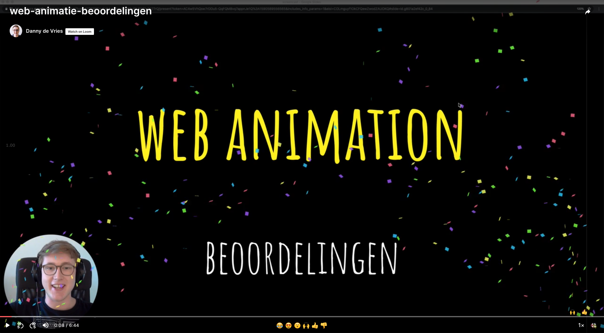
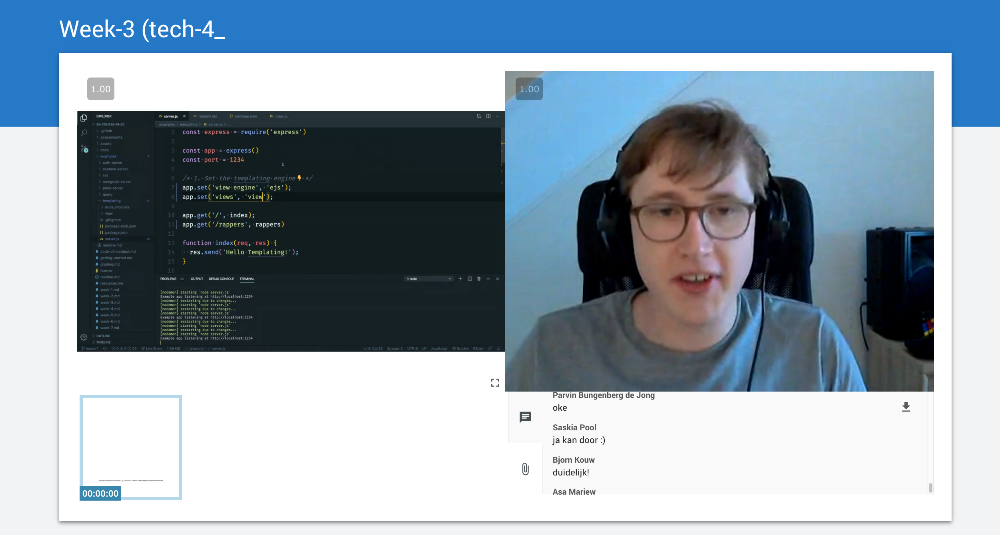
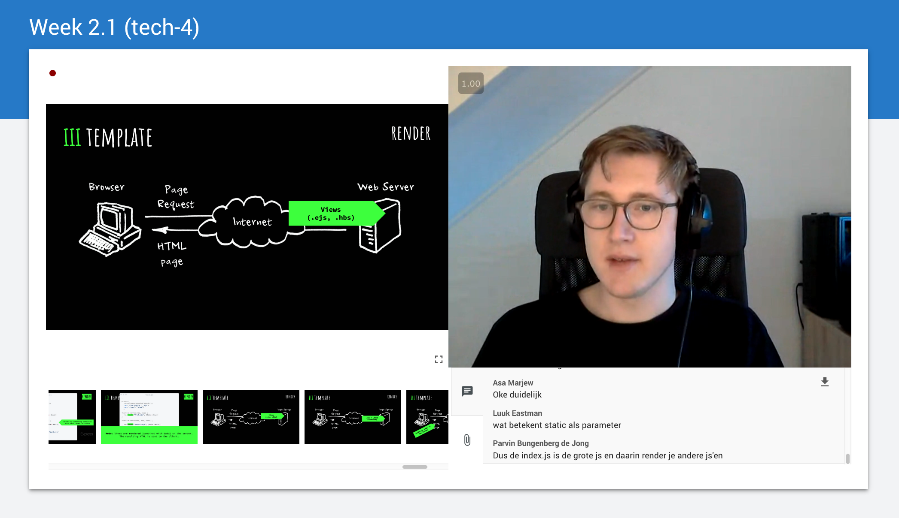

# Assessment - Thema-2

## Metadata

- Cursus: Basiskwalificatie Didactische Bekwaamheid (BDB)
- Docent: Danny de Vries (Docent Webtechnologie)
- Jaar: Feb - Jun 2020
- Universeit: Hogeschool van Amsterdam (HvA Academie)
- Opleiding: Communication and Multimedia Design (voltijd CROHO: 34092)
- Faculteit: Digital Media and Creative Industries
- Leergroep: De Zwarte Piste

## Inhoudsopgave

- [Opdracht](#opdracht)
- [Beeldcoaching](#beeldcoaching)
- [Lesopzet](#lesopzet)
- [Bronnen](#bronnen)

## Opdracht

### Thema 2

Het doel van thema-2 is de vormgeving van jouw begeleidingsrol als docent en het activeren van jouw onderwijs binnen verschillende (online) onderwijsvormen.

### Assessment

Om het thema af te ronden werken we binnen de BDB met Peer Assessments, een toetsvorm waarbij het werk wordt beoordeeld en van feedback wordt voorzien door de leergroep. Het laat zien dat je voldoet aan de criteria en je levert daarvoor bewijslast. Daarnaast reflecteer je op je ontwikkeling.

#### Criteria thema-2

1. Je kunt de bouwstenen voor effectieve didactiek toepassen in je onderwijs
2. Je kunt jouw rol als docent invullen door het bewust inzetten van verbale en non-verbale communicatie- en gesprekstechnieken
3. Je kunt verschillende didactische vormen doelbewust inzetten om het leren van studenten te bevorderen

#### Bewijsmateriaal thema-2

1. Verslag van gesprek met je werkplekbegeleider, naar aanleiding van een observatie van hem of haar in jouw (online) les. Basis van dit gesprek is ontwikkeling op je eigen je eigen leervraag/vragen.
2. Verslag van de opbrengst van de begeleide beeldcoaching in de leergroep. Wat heb je geleerd?
3. Een verslag (vorm is vrij) van een aanpassing van een lesopzet op basis van de 12 bouwstenen voor effectieve didactiek (zie voor inspiratievragen: einde van elk hoofdstuk over een bouwsteen)

> Door het analyseren van de beelden tijdens de beeldcoaching en het doorlopen van een lesopzet en die toetsen aan de 12 bouwstenen voor effectieve didactiek laat ik zien dat ik aan de criteria voor thema-2 heb voldaan.

## Beeldcoaching

Tijdens de beeldoaching heb ik een aantal fragmenten uitgekozen van zowel fysiek als digitaal onderwijs dat ik de afgelopen weken heb gegeven. De grootste feedback die ik van studenten en collega's wel eens krijg is dat ik in bepaalde situaties hele verschillende houdingen heb. Als ik voor de klas in een grotere groep spreek (college, instructie) ben ik me erg aan het focussen op m'n verhaal en kom daar misschien wat 'strenger' over. Terwijl als ik studenten help, ze aan de slag gaan met opdrachten of feedback geef, ik veel 'losser' ben. Op de een of andere manier meer 'benaderbaar' ben. Vandaar dat ik specifiek fragmenten heb uitgekozen waar ik wellicht wat 'autoritair' overkom. Mijn kijkvraag was dan ook:

> Wat is het gevoel bij dit fragment (autoritair, te serieus)? Helder en gestructureerd maar nodigt dit uit tot vragen en input van de klas?

**Waar stond ik:**

Na de feedback van de leergroep, collega's en beeldcoach is het niet zo dat ik 'streng' ben maar wel 'helder' en 'gestructureerd' en dat is niet hetzelfde als streng of autoritair. Wel kan ik meer open vragen stellen en ruimte laten om de klas input te laten geven. Meer de klas uitnodigen om vragen te stellen, misschien ook als actieve werkvorm. De studenten ook tijdens de instructie er meer erbij betrekken dan alleen maar 'zenden'.

**Waar sta ik nu:**

In de laatste paar werkgroepen die ik online heb gegeven ben ik iets 'losser' geworden, wat ook in het tweede fragment van de beeldcoaching is terug te zien. Ik dwaal wat meer af maar laat wel meer ruimte voor improvisatie en tussendoor wat humor. Een betere aansluiting met de studenten. Ook ben ik veel meer 'tussendoor' vragen gaan stellen, in plaats van door te willen naar een onderwerp en daar over te vertellen vraag ik aan studenten 'zijn er mensen die met techniek x hebben gewerkt?' of 'wat vonden jullie van wat ik net verteld heb?' om meer open vragen te stellen en reacties van de studenten te krijgen. Digitaal is dat nog wat lastig, soms roep ik mensen bij naam uit de deelnemerslijst maar vaak reageren de studenten in de chat.

→ [Bekijk de volledige reflectie over de beeldcoaching](../thema-2/beeldcoaching)

## Lesopzet

In thema-1 had ik al aardig wat geschreven over mijn lesopzet en daarin de feedback van studenten meegenomen en mijn les aangepast. Na het lezen van de 12 bouwstenen ben ik dat nog een keer gaan doen en zijn er wederom wijzigingen die ik het huidige blok heb doorgevoerd.

**Waar stond ik:**

Uit thema-1 bleek ook dat studenten nog meer behoefte hadden aan live demo's en praktijkvoorbeelden, bouwsteen 3 (gebruik voorbeelden) gaat daar ook over. Daarnaast waren mijn slides en feedback nog veelal geschreven. Daar zag ik nog veel kansen om dat om te zetten naar beeld of video, bouwsteen 4 (combineer woord en beeld).

**Waar sta ik nu:**

Ik ben nog actiever voorbeelden en demo's in m'n lessen gaan verwerken. Door in een VCL bijvoorbeeld m'n code editor te openen en in plaats van slides 'gewoon' code te gaan schrijven. Daarnaast ben ik veel teksten en geschreven feedback die ik gaf om gaan zetten in diagrammen en screencasts zodat studenten die kunnen bekijken. Ik kan nog meer aan de slag met bouwsteen 5 (laat leerstof actief verwerken) en bouwsteen 9 (zorg voor afwisseling in oefentypes). In mijn werkgroepen laat ik de ruimte om vragen te stellen na elke ‘sectie’ maar eigenlijk zijn dat ideale momenten om studenten actief met de stof aan de slag te gaan door ze een opdracht te geven. De werkgroep voelt soms nog teveel als een ‘college’ omdat ik veel aan het zenden ben.

_Voorbeeld van een screencast waar ik feedback geef op de beoordelingen_

_Voorbeeld van een virtual classroom waar ik 'live' code aan het schrijven ben in plaats van slides._

_Voorbeeld van schema in de slides die eerst bullet points of tekst waren._

→ [Bekijk alle aanpassingen voor de lesopzet](../thema-2/lesopzet)

## Bewijsmateriaal

→ [Reflectie beeldcoaching (leergroep)](../thema-2/beeldcoaching)  
→ [Reflectie beeldcoaching (werkplekbegeleider)](../thema-2/beeldcoaching#werkplekbegeleider)  
→ [Aanpassingen lesopzet volgens bouwstenen](../thema-2/lesopzet)

## Bronnen

- [Zie colofon](../meta)
- [Zie verslag van de beeldcoaching](../thema-3/beeldcoaching)
- [Valentina Devid (2020). Feedback: de magic bullet voor leren?](https://www.vernieuwenderwijs.nl/feedback-de-magic-bullet-voor-leren/)
- Marianne Meijers (2018). Ontwerp je ontwikkeling.
- David Didau (2015). What If Everything You Knew about Education Was Wrong?
- Tim Surma (2019). Wijze Lessen: 12 bouwstenen voor effectieve didactiek
- Karin Scager (2006). De docent als coach
