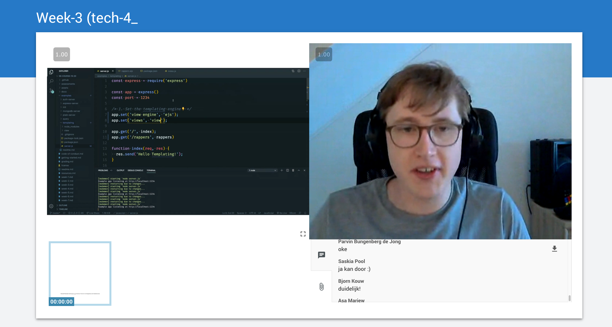
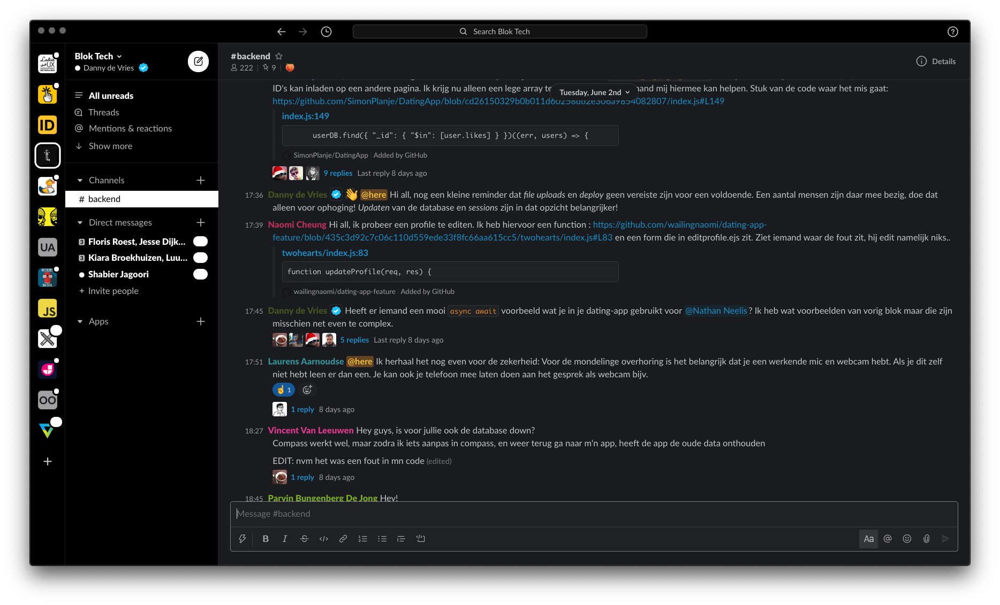

## Lesopzet

> Voor deze opdracht heb ik een 'reguliere' werkgroep van het vak back-end genomen en wijzigingen doorgevoerd tussen blok 3 en 4. Daarbij heb ik ook de feedback die ik van studenten uit thema-1 heb gekregen meegenomen in de verbeteringen. Ik heb niet elke bouwsteen beschreven omdat sommige al aanwezig waren in een werkgroep, ik heb alleen de bouwstenen die aangesterkt konden worden uit.

#### 1. Activeer relevante voorkennis

**Aanwezig:** elke werkgroep heeft een korte 'recap' van de stof uit de vorige week ter herhaling.

#### 2. Geef duidelijke, gestructureerde en uitdagende instructie

**Aanwezig:** als er ding is wat ik kan dan is dat gestructureerd werken. Dat vertaald zich ook door in de lessen. Na een korte check-in of ijsbreker is er een slide waarin ik doorneem wat we deze les (of week) gaan doen en waar de studenten naartoe werken in hun opdrachten.

#### 3. Gebruik voorbeelden

**Verbeterd:** in de slides van de werkgroepen staan er vaak al veel voorbeelden van stukken code of staat er in bullet points beschreven hoe een feature of stuk code werkt. Maar dat is nog niet echt 'demonstreren'. Aan het eind van blok 3 en nu ook in blok 4 ben ik actiever aan de slag gegaan (ook naar aanleiding van de feedback van thema-1 waar studenten aangeven het fijn vinden als ik code demonstreer en 'live' schrijf) om code te demonstreren. Zowel in-class in de VCL door wat meer van de slides af te wijken en screen sharing te doen als out-class in de vorm van screencasts.

_Voorbeeld van een virtual classroom waar ik 'live' code aan het schrijven ben in plaats van slides._

#### 4. Combineer woord en Beeld

**Verbeterd:** heel veel dingen die ik als announcement zou posten of als tekst ben ik steeds meer aan het omzetten naar korte video's. Ook bijvoorbeeld voor feedback, in plaats van schrijven kunnen studenten een video kijken en in sommige gevallen transcribeer ik ook nog eens de tekst. Daarnaast ben ik nog meer bullet points in de slides aan het omzetten naar visuele diagrammen.

_Voorbeeld van schema in de slides die eerst bullet points of tekst waren._

#### 5. Laat leerstoef actief verwerken

**Kan nog beter:** in mijn werkgroepen laat ik de ruimte om vragen te stellen na elke 'sectie' maar eigenlijk zijn dat ideale momenten om studenten actief met de stof aan de slag te gaan door ze een opdracht te geven. De werkgroep voelt soms nog teveel als een 'college' omdat ik veel aan het zenden ben.

#### 6. Achterhaal of de hele klas het begrepen heeft

**Aanwezig:** in een klaslokaal kan ik aan de visuel cue's zijn hoe een klas zich voelt. Meestal loop ik na de instructie door het klaslokaal en doe een korte check-in bij elk groepje. Digitaal vind ik dit lastiger maar is de chat vaak een bevestiging. Vaak schrijven de studenten helder, duidelijk en kunnen we door met het volgende onderwerp.

#### 7. Ondersteun bij moeilijke opdrachten

**Aanwezig:** naast de instructie uit de werkgroep zijn er out-of class in de leeromgeving veel verdiepende en verhelderende bronnen die studenten lezen om zich de stof uit de werkgroep eigen te maken. Ik vraag er vaak naar of ze deze gelezen hebben, aantekeningen willen maken en blijft ze daar actief naartoe verwijzen.

_Een overzicht van extra bronnen en code voorbeelden die studenten kunnen helpen._

#### 8. Spreid oefening met leerstof in de tijd

**Aanwezig:** het voordeel van twee werkgroepen per week is dat je dit kan doen. Maandag krijgen de studenten instructie en een opdracht om aan te werken en donderdag hebben ze al voortgang gemaakt en kunnen we die klassikaal bespreken. Met die feedback / voortgang kunnen studenten verder en de week erop blikken we daar weer op terug.

#### 9. Zorg voor afwisseling in oefentypes

**Kan nog beter:** ik wil nog meer verscheidenheid van actieve werkvormen in de werkgroepen. Wel zijn er naast de werkgroep in de leeromgeving voorbeelden per onderwerp te vinden waar de studenten de code van kunnen ontleden.

#### 10. Gebruik toetsing als leer- en oefenstrategie

**Kan nog beter:** afgezien van af en toe een poll, check-in of kahoot in de les denk ik dat deze bouwsteen nog een punt van aandacht is. De recap die ik in de lessen geef is vaak nog herhaling (herlezen) maar niet in een actievere vorm, dat zou wel nog kunnen.

#### 11. Geef feedback die leerlingen aan het denken zet

**Aanwezig:** door het inleveren van de voortgang (in de vorm van opdrachten en issues) kan ik snel directe feedback geven die ze aanzet om verder met hun applicatie aan de slag te gaan. Daarnaast hebben we een Slack waar studenten constant ook elkaar vragen kunnen stellen en zijn er student-assisten die ze met specifieke problemen kunnen helpen.

_Voorbeeld van studenten die elkaar helpen en feedback geven in Slack._

#### 12. Leer je leerlingen effectief leren

**Aanwezig:** omdat ik zelf recent nog student ben geweest ook aan de opleiding waar ik nu lesgeef kan ik me heel goed verplaatsen in de student. Ik schrijf voorbereiding voor beoordelingen en kick-off colleges voor opdrachten altijd vanuit de student en hoe ik dat al student dat fijn vinden. In de lessen besteed ik vaak aan het begin en aan het eind uitgebreid aandacht aan de beoordeling zodat deze helder en transparent is. Maar ook tactieken aangezien code soms moeilijke stof is, ik laat vaak zien hoe ik het zelf zou aanpakken of hoe ik een opdracht zou ontleden.

> Verder merk ik dat ik veel over mijn lesopzet en de opzet van een vak heb beschreven in thema-1. Daar komen veel van deze onderwerpen terug en worden ze verder uitgelegd.

→ [Thema-1 assessment](../thema-1/assessment)
