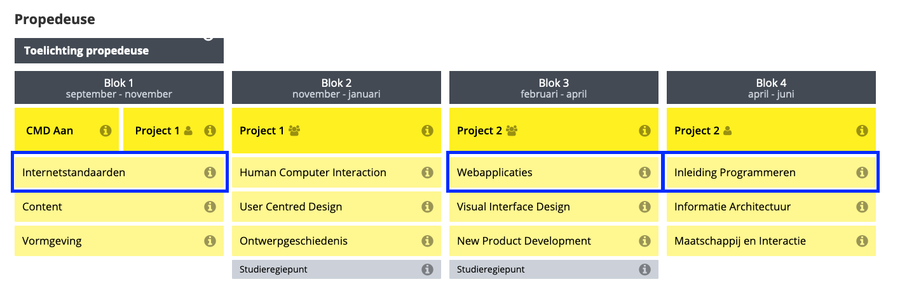
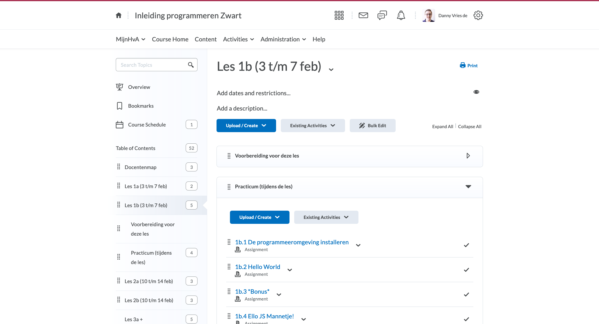
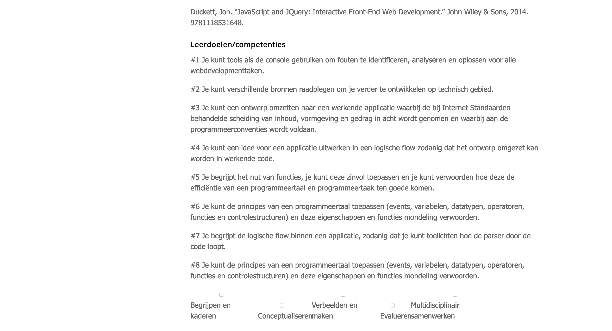
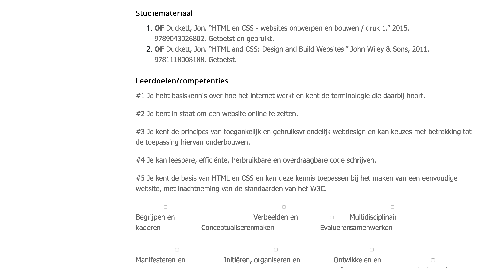

# Ontwerpopdracht Analyse

## Metadata
* Cursus: Basiskwalificatie Didactische Bekwaamheid (BDB)
* Docent: Danny de Vries (Docent Webtechnologie)
* Jaar: Feb - Jun 2020
* Universeit: Hogeschool van Amsterdam (HvA Academie)
* Opleiding: Communication and Multimedia Design (voltijd CROHO: 34092)
* Faculteit: Digital Media and Creative Industries
* Leergroep: De Zwarte Piste

## Inhoudsopgave
* [Introductie](#introductie)
* [Keuze module](#keuze-module)
* [Communicatie](#communicatie)
* [Situational Factors](#situational-factors)
* [Leerdoelen](#leerdoelen)
* [Leeractiviteiten](#feedback)
* [Toetsing](#feedback)
* [Alignment](#feedback)
* [Evaluaties](#feedback)
* [Probleemstelling](#feedback)
* [Bronnen](#bronnen)
* [Bijlage](#bijlagen)

### Introductie 

Bij CMD amsterdam zijn we het fundament aan het herontwerpen voor studiejaar 20/21, een grote curriculumvernieuwing voor de propedeuse. Onze curriculumcommisie overziet dit herontwerp en neemt vooral de organisatorische taak opzich. **Aan mij is door de curriculumcomissie gevraagd om vorm te geven aan het vak `tech-0`, het allereerste technische vak binnen onze opleiding**.

Op het moment hebben we drie technische vakken in het propedeuse jaar. _Internetstandaarden_, _Inleiding programmeren_ & _Webapplicaties_. Waarvan Webapplicaties een vak is wat wel 'technisch' is maar waar niet echt 'programmeren'. Daarom focust mijn analyse zich op _Internetstandaarden_ en het vak waar ik ook zelf in lesgeef _Inleiding programmeren_.

De huidige drie technische vakken zijn _verplichte studieonderdelen_ voor elke propedeuse student (3ECTS). Er zijn 4 clusters met elk ongeveer ~5 klassen, elk vak heeft dus 20 klassen (exclusief herkansingsklassen) en 2 module coördinatoren. De vakken worden gespiegeld aangeboden (verspreid over 4 blokken).

De vakken bestaan sinds studiejaar 2014 (ongeveer 6 jaar) met dezelfde module coördinatoren. De samenstelling van docenten is wel veel gewijzigd. Zeg dat er ongeveer elke twee jaar nieuwe vakdocenten wisselen of bijkomen.

Het idee is dan ook om deze drie vakken te vervangen voor `tech-0`, `tech-1` en `tech-2` (in die volgorde) waarbij tech-0 het introductie vak gaat worden, de grande entree. De andere technische vakken zouden daarop aansluiten en meer verdieping geven.

*Overzicht van de technische vakken in het huidige curriculum.*

### Keuze module

**Het krachtige aan `tech-0` is dat dit voor veel studenten de eerste aanraking is met techniek**, websites programmeren in HTML, CSS & JavaScript. Je hebt als coordinator (en docent) eigenlijk vrij spel om deze studenten enthousiast te maken voor techniek. 

Daarnaast vinden studenten de huidige technische vakken vaak 'moeilijk', iets wat terug te lezen is in de vakevaluaties en blokenquetes van de afgelopen jaren. Ondanks dat de vakinhoud (minder lezen, minder tussenopdrachten) de afgelopen jaren is teruggebracht en er steeds minder inhoudelijk getoetst wordt op de rubric blijven studenten dit noemen in de vakevaluatie. Ik denk dat er een aantal onderliggende 'problemen' in het vak zitten die eigenlijk niks met de vakinhoud te maken hebben:

* De focus van de vakken zit nu vooral op _know-why_ en niet zozeer op _know-what_ (of _know-how_). De vakken gaan snel naar 'the big picture' en focussen op het ontwikkelen van code literacy in plaats van resultaatgericht en meteen met code experimenteren.
* Dat raakt meteen aan het tweede punt waardoor ik denk dat studenten aangeven het vak 'moeilijk' te vinden. Omdat veel studenten het vak misschien ook gewoon niet 'leuk vinden'. Het is vaak taaie technische stof en studenten zien niet de mogelijkheden van web technologie.

Verder denk ik dat de vakinhoud ook een update kan gebruiken, ook daar zie ik verbetering. Vooral de vakinhoud van internetstandaarden is verourderd (oude code standaarden) en ook bij inleiding programmeren zijn er nieuwe ontwikkelingen in de JavaScript programmeertaal die niet in de vakinhoud zitten waardoor er een groot 'gat' ontstaat naar technische vakken in de latere jaren waar dat wel in de vakinhoud zit.

 De vakken zijn qua vakinhoud nu 4 jaar oud en enigszins over de houdbaarheidsdatum heen, technische ontwikkeling gaat snel. Er is in die jaren wel geïtereerd op de vakken: vooral het lesprogramma (de leeractiviteiten) en organisatorisch is het steeds beter geworden maar **qua toetsing en algemene vakinhoud zijn de vakken in de 4 jaar (zeker de afgelopen 2 jaar) weinig veranderd**.
 
Als docent ben ik niet geheel ontevreden over de huidige vakken, ik zie natuurlijk verbeterpunten en zie dat de vakken toe zijn aan een 'update' maar 'problematisch' zou ik de vakken niet noemen. Ik heb ze dit studiejaar (vooral inleiding programmeren) met veel plezier gegeven.

`tech-0` is in dat opzicht ook een belangrijk vak. Het zal, zoals eerder aangegeven, voor veel studenten de toon zetten voor techniek en ze hopelijk enthousiasmeren over technische mogelijkheden ook in het verdere verloop van de studie. Iets wat nu in mijn optiek enigszins ontbreekt.

Hier begint mijn analyse, van de vakken _internetstandaarden_ en _inleiding programmeren_ op basis van mijn eigen ervaringen en vakevaluaties & blokenquetes.

### Communicatie

Er zijn geen vaste kalibraties ingeroosterd voor docenten maar **de samenwerking tussen docent en coördinator is erg goed te noemen**. Wat scheelt is dat we als docenten in Slack zitten en constant met elkaar bespreken. Wat dus wel enigszins mist is een systematische manier van inwerken en kalibreren. Dit gebeurd meer 'op aanvraag'. De coördinator is goed bereikbaar maar kan wellicht wel **meer aanzetten tot onderlinge afstemming tussen docenten** en intervisie momenten inplannen. Bij lessen kijken is daar een concreet voorbeeld van, dat doe ik zelf wel maar gebeurd onderling weinig. Evaluatie's na een blok (of aan het eind van een vak) worden wel systematisch ingepland.

Als docent is er alle vrijheid om het vak naar je eigen hand te zetten als in slides aanpassen, tussenopdrachten in de les hier en daar herschrijven. Wat in mijn optiek een breder CMD probleem is dat als er vaste intervisie / kalibratie momenten zijn voor een vak **niet altijd alle docenten aanwezig zijn of eventueel achteraf nog input geven**. Bij onze tech-expertise groep ervaar ik dat ook zo, er is een vaste kern van docenten die bijeen komen maar zeker de helft van de technische docenten onbtreekt vaak. 

#### DLO

De Digitale Leeromgeving (DLO, Brightspace) is goed ingericht, **alle basis informatie (over toetsing, weekopzet etc.) is ruim voor het vak begint beschikbaar voor studenten en docenten**. Er is gekozen voor een weekopzet en daar zijn alle slides, opdrachten, proeftoetsen, beoordelingsformulieren en verdiepende bronnen te vinden. Via de announcements wordt informatie naar de studenten gecommuniceerd. Hier en daar laat de structuur nog wat te wensen over, wat studenten soms aangeven lastig te vinden is dat het niet altijd **eenduidig is welke opdrachten voorbereiding zijn en welke er in de les worden gemaakt**. Omdat we veel practica doen raken studenten soms de draad kwijt.

*Screenshot van de Inleiding programmeren course op brightspace.*

#### Studiegids

De praktische informatie in de studiegids is correct. **Wel vind ik van beide vakken de omschrijving nog wat oppervlakkig**, heel breed en generiek en gaat ook vooral over cognitief (inhoudelijk) skills. Ook de relatie met de beroepspraktijk is wat 'simpel'. Niet helder of duidelijk uitgelegd wat het belang is van het vak voor de verdere loopbaan van de student. Verder staat er vaak bij de taal van het onderwijs 'nederlands' terwijl we toch veel 'engelse' online resources gebruiken.

### Situational Factors

**Wat mij betreft de grootste factor is, is het niveau verschil binnen een klas.** Sommige studenten hebben al voorkennis vanwege een MBO opleiding (slaan de basis over) andere willen juist de tijd hebben om de basis eigen te maken (1e generatie studenten, havisten). Studenten zijn over het algemeen wat 'bangig' voor techniek, er lijkt een soort **stigma om techniek en programmeren te hangen**. Ik kan moeilijk achterhalen waar dat hem precies in zit, misschien denken studenten dat het 'wiskundig' is of dat je een 'nerd (witte blanke man met een hoodie)' moet zijn om het goed te kunnen. Het vak moet ze 'zelfvertrouwen' geven om te experimenten met techniek en slaagt daar niet altijd in.

Bij _inleiding programmeren_ is het nog lastiger om ze dat zelfvertoruwen te geven. Sommige studenten hebben dan al moeite gehad met het voorgaande vak _internetstandaarden_ en probeer ze dan maar weer enthousiast te maken voor techniek. Houding is vaak al 'ik kan het toch niet'.

* **Klas:** Grote klassen (25/30) waardoor het voor docenten lastig is iedereen individueel aandacht te geven. Juist omdat je bij dit vak extra ruimte wilt nemen om studenten die het 'zwaar' hebben extra te motiveren. Mix van man / vrouw.
* **Lesuren:** Het vak is 2x 2 lesuren in de week (voorheen 1x 3/4 lesuren). Bij technische vakken in de latere jaren merk ik dat studenten de lessen van 3/4 lesuren te lang vinden. Door kortere lessen forceer je studenten enigszins zich beter voor te bereiden omdat de lestijd wat korter is.
* **Inhoud:** Veelal werkgroepen en huiswerk (opdrachten) via de leeromgeving. Veel van de theorie komt uit het lezen van een boek en ik vraag me of dat het beste medium is. Het boek is wel heel visueel met diagrammen, dat helpt.
* **Docenten:** Het enthousiasme van een docent is in mijn optiek doorslaggevend. Of de docent het in begrijpelijk taal kan uitleggen, enthousiasme en passie heeft voor programmeren en of de docent bereikbaar is buiten de les heeft grote impact op het slagen van de student. Er zijn ook docenten die het vak als student (waaronder ik) hebben gehad en nu geven. Helpt heel erg met het verplaatsen in de student.
* Er is vanuit het bedrijfsleven veel vraag naar techneuten, alleen **studenten zien vaak het belang van techniek nog niet helemaal**. Studenten zien techniek zwart-wit. _Je kan het of je kan het niet_ en dat is mijn optiek gewoonweg niet waar.
* Programmeren gaat niet alleen over het leren van een specifieke programmeertaal maar ook over probleem oplossend vermogen (code literacy), bronnen op waarde schatten en experimenteren met oplossingen en mogelijkheden.

### Leerdoelen

De leerdoelen voor _Inleiding programmeren_ van 17/18 verschillen erg ten opzichte van 18/19. Ze zijn beduidend beter en er is een betere spreiding van de taxonomie. Voorheen ging vooral over 'application' en 'increase knowledge' (cognitief). Vanaf 18/19 zit er veel meer reflecteren en evalueren in de leerdoelen. De leerdoelen in 19/20 zijn ongewijzigd. Wat me wel opvalt is dat in de beschrijving van het vak best wel teksten die hints geven naar **evalueren en reflectere maar daar is geen expliciet leerdoel van gemaakt**.

Vooral bij de leerdoelen van _internetstandaarden_ vind ik dat de leerdoelen vooral over 'increased knowledge' en toepassen gaan het mag wat mij betreft nog iets meer over analyseren van code (overdraagbaarheid) gaan. **Verder mis ik bij beide vakken de 'human dimension' of 'caring'**. Terwijl caring voor techniek me erg belangrijk lijkt, passie en mogelijkheden van techniek ontdekken maar ook human dimension: 'wat kan ik later in de design wereld met techniek'.

* Beide vakken hebben rond de 5/6 leerdoelen, dat is bij technische vakken in het tweede jaar ook het geval.
* Elke week heeft vaak een soort van 'thema' (subleerdoelen) met elke week een technisch concept uit het studiemateriaal. Die staan niet in de studiegids beschreven, en ook op Brightspace zijn die alleen voor docenten beschikbaar.
* Verder plaatsen we onder de leerdoelen de CMD competenties, en bijvoorbeeld bij internetstandaarden staan bijna alle competenties. Ik kan me haast niet voorstellen dat die allemaal expliciet getoetst worden. Ze komen binnen de lessen aanbodt maar worden niet expliciet getoetsts.
* De leerdoelen zijn vanuit de 'je-vorm' geschreven maar morgen misschien nnog meer werkwoorden bevatten. Er staat nu vaak 'kan' of 'kunt' maar zouden herschreven kunnen worden naar actieve werkwoorden (toepassen, analyseren, creeren etc.)

*Huidige leerdoelen van inleiding programmeren (studiejaar 19/20).*

*Huidige leerdoelen van internetstandaarden (studiejaar 19/20).*

### Leeractiviteiten

De M.C. Toetsen zorgen voor het masteren van de content. De eindopdracht zorgt voor het gebruik van de content en toepassen.

Door de M.C. toets zijn er in het vak 'checks' ingebouwd. Daarnaast is er voor de eindopdracht een moment waarbij concepten worden besproken waardoor het mogelijk is om het leren bij te sturen.

Er is een redelijke mix van in-class en out-of-class activities. Lezen van een boek, maken van opdrachten en vervolgens bespreken in de klas. Dingen als programmeeromgeving mag iets meer out-of-class.

Het vak heeft enigszins een problem-based approach. Er staat stapgsgewijs beschreven wat het eindresultaat moet zijn maar de studenten moeten zelf de stappen schrijven. Het is nog wel veel hand vasthouden. Er is geen sprake van team-based learning of accelerated learning.

Inleiding programmeren is vooral oppervlakte leren. Het onthouden en begrijpen van techniek en programmeertalen. Daarnaast raken we punten van diepte-leren door het toepassen in een prototype en het analyseren (concept opbreken in stapjes). Van evalueren binnen de taxonomie is eigenlijk geen sprake.

Denk dat er meer praktijkvoorbeelden in het vak moeten. Er zijn veel 'fictieve' opdrachtjes maar weinig echte use cases ingebouwd waaran studenten zien hoe techniek in de praktijk is. Of uitleggen waarom techniek in het bedrijfsveld belangrijk zijn.

Nieuwe ondersteunende theorie, niet een boek maar diversiteit in bronnen.

### Toetsing

Er zijn twee M.C. toetsen die met een voldoende moeten worden afgesloten, deze zijn niet compenseerbaar. Tellen 10% van het eindcijfer. Verder is er een product dat mondeling wordt toegelicht. Deze telt 90% mee van het eindcijfer.

* **Valideit**: Voor de M.C. Toets gaat het puur om kennis toetsen maar zegt niets over toepassen. Je kan JavaScript leren als taal maar toepassen is lastig. Geeft wel druk voor de student om stof eigen te makmen.
* **Betrouwbaarheid:** M.C. toets is digitaal in de les zelfde omstandigheden. Moeilijk aan de mondelinge toets is de tijdsduur. Understanding toetsen in 15 / 20 minuten per student is lastig. Daarom moet een student ook vaak live wijzigingen aanbrengen.
* **Transparantie**: Voor de M.C. toets worden voorbeeldvragen gegeven en klassikaal besproken. Het beoordelingsformulier word in de les besproken en staat duidelijk gecommuniceerd op Brightspace
* **Leerfunctie**: De M.C. Toets geeft druk voor de studenten om de stof bij te houden en het bloek te blijven lezen. De eindopdracht zorgt ervoor dat ze die moeten toepassen. Na het maken van de eindopdrachten zijn er altijd nog verbeterpunten maar weinig studenten raken dan hun code nog aan.

Beoordelignsformulier en criteria wel vrij technisch, dit van de taal moet er inzitten in plaats van uitleg. Voelt als iets meer een afvink lijstje.

Het slagingspercentage van de eerste kans is best laag.

### Alignment
Grotendeels. Ik zie enigszins een 'gat' tussen een aantal leerdoelen en de leeractiviteiten. Voor 2 leerdoelen zullen studenten ze 'aanraken' tijdens het maken van de eindopdracht maar in het vak zijn er geen leeractiviteiten die dat ondersteunen. Een aantal leerdoelen gaan over reflecteren en begrip en naast het mondeling zijn ook daar in het vak niet direct leeractiviteiten voor. Wel vind ik dat de toetsactiviteiten aansluiten bij wat er getoetst moet worden.

Al kan er worden afgevraagd of er voor de M.C. Toets nog een betere toetsvorm gevonden kan worden om kennis te meten. Verder vind ik dat er weinig diversiteit in het studiemateriaal zit, verschillende bronnen, vormen van lesmateriaal (alleen boek). Als een leerdoel bronnen raadplegen is zit dat niet goed genoeg in het vak.

### Evaluaties

#### Studentenevaluatie (blokenquete)

#### Docentenevaluatie (vakevaluatie)

### Probleemstelling
Een aantal van deze dingen op de lijst komen structuureel terug uit de vakevaluaties en blokenquetes. 
* Studenten beginnen te laat met de eindopdracht.
* Studenten krijgen bijles maar die studenten helpen ze niet echt maar maken hun huiswerk. Veel andere studenten maken hun huiswerk.

### Bronnen
* Vakevaluaties internetstandaarden (studiejaar 17/18 & 18/19 - via moodle)
* Vakevaluaties inleiding programmeren (studiejaar 17/18 & 18/19 - via moodle)
* Blokenquetes internetstandaarden (studiejaar 17/18 & 18/19 - via moodle)
* Blokenquetes inleiding programmeren (studiejaar 17/18 & 18/19 - via moodle)
* [Studiegids internetstandaarden (via studiegids.hva.nl)][studieis]
* [Studiegids inleiding programmeren (via studiegids.hva.nl)][studieip]
* Dee Fink. (2013). Creating Significant Learning Experiences.
* Veronica Bruijns. (2020) Kennisclip Toetscyclus en kwaliteit Toetsing.
* Margot van Rotterdam. (2020). Kennisclip Constructive Alignment. 

### Bijlage
* [Volledige analyse internetstandaarden (op GitHub)][is]
* [Volledige analyse inleiding programmeren (op GitHub)][ip]

[ip]: https://github.com/CMDA/tech-0_ontwikkeling/blob/master/analyse/inleiding-programmeren.md
[is]: https://github.com/CMDA/tech-0_ontwikkeling/blob/master/analyse/internetstandaarden.md
[studieis]: https://studiegids.hva.nl/co/cmd-vt/100000000/010607
[studieip]: https://studiegids.hva.nl/co/cmd-vt/100000000/010616
