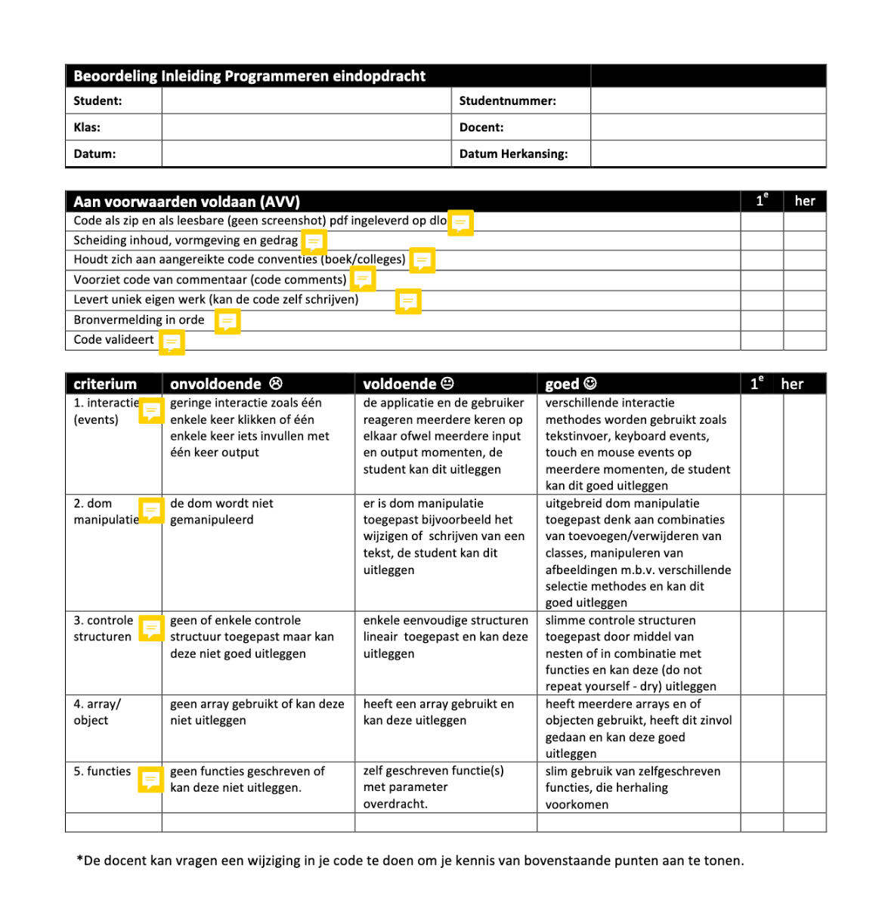

# Ontwerpopdracht Analyse

## Metadata
* Cursus: Basiskwalificatie Didactische Bekwaamheid (BDB)
* Docent: Danny de Vries (Docent Webtechnologie)
* Jaar: Feb - Jun 2020
* Universeit: Hogeschool van Amsterdam (HvA Academie)
* Opleiding: Communication and Multimedia Design (voltijd CROHO: 34092)
* Faculteit: Digital Media and Creative Industries
* Leergroep: De Zwarte Piste

## Inhoudsopgave
* [Introductie](#introductie)
* [Keuze module](#keuze-module)
* [Communicatie](#communicatie)
* [Situational Factors](#situational-factors)
* [Leerdoelen](#leerdoelen)
* [Leeractiviteiten](#leeractiviteiten)
* [Toetsing](#toetsing)
* [Alignment](#alignment)
* [Evaluaties](#evaluaties)
* [Verbeterpunten](#verbeterpunten)
* [Bronnen](#bronnen)
* [Bijlage](#bijlage)

### Introductie 

Bij CMD amsterdam zijn we het fundament aan het herontwerpen voor studiejaar 20/21, een grote curriculumvernieuwing voor de propedeuse. Onze curriculumcommisie overziet dit herontwerp en neemt vooral de organisatorische taak opzich. **Aan mij is door de curriculumcomissie gevraagd om vorm te geven aan het vak `tech-0`, het allereerste technische vak binnen onze opleiding**.

Op het moment hebben we drie technische vakken in het propedeuse jaar. _Internetstandaarden_, _Inleiding programmeren_ & _Webapplicaties_. Waarvan Webapplicaties een vak is wat wel 'technisch' is maar waar niet echt 'programmeren'. Daarom focust mijn analyse zich op _Internetstandaarden_ en het vak waar ik ook zelf in lesgeef _Inleiding programmeren_.

De huidige drie technische vakken zijn _verplichte studieonderdelen_ voor elke propedeuse student (3ECTS). Er zijn 4 clusters met elk ongeveer ~5 klassen, elk vak heeft dus 20 klassen (exclusief herkansingsklassen) en 2 module coördinatoren. De vakken worden gespiegeld aangeboden (verspreid over 4 blokken).

De vakken bestaan sinds studiejaar 2014 (ongeveer 6 jaar) met dezelfde module coördinatoren. De samenstelling van docenten is wel veel gewijzigd. Zeg dat er ongeveer elke twee jaar nieuwe vakdocenten wisselen of bijkomen.

Het idee is dan ook om deze drie vakken te vervangen voor `tech-0`, `tech-1` en `tech-2` (in die volgorde) waarbij tech-0 het introductie vak gaat worden, de grande entree. De andere technische vakken zouden daarop aansluiten en meer verdieping geven.

*Overzicht van de technische vakken in het huidige curriculum.*

### Keuze module

**Het krachtige aan `tech-0` is dat dit voor veel studenten de eerste aanraking is met techniek**, websites programmeren in HTML, CSS & JavaScript. Je hebt als coordinator (en docent) eigenlijk vrij spel om deze studenten enthousiast te maken voor techniek. 

Daarnaast vinden studenten de huidige technische vakken vaak 'moeilijk', iets wat terug te lezen is in de vakevaluaties en blokenquetes van de afgelopen jaren. Ondanks dat de vakinhoud (minder lezen, minder tussenopdrachten) de afgelopen jaren is teruggebracht en er steeds minder inhoudelijk getoetst wordt op de rubric blijven studenten dit noemen in de vakevaluatie. Ik denk dat er een aantal onderliggende 'problemen' in het vak zitten die eigenlijk niks met de vakinhoud te maken hebben:

* De focus van de vakken zit nu vooral op _know-why_ en niet zozeer op _know-what_ (of _know-how_). De vakken gaan snel naar 'the big picture' en focussen op het ontwikkelen van code literacy in plaats van resultaatgericht en meteen met code experimenteren.
* Dat raakt meteen aan het tweede punt waardoor ik denk dat studenten aangeven het vak 'moeilijk' te vinden. Omdat veel studenten het vak misschien ook gewoon niet 'leuk vinden'. Het is vaak taaie technische stof en studenten zien niet de mogelijkheden van web technologie.

Verder denk ik dat de vakinhoud ook een update kan gebruiken, ook daar zie ik verbetering. Vooral de vakinhoud van internetstandaarden is verourderd (oude code standaarden) en ook bij inleiding programmeren zijn er nieuwe ontwikkelingen in de JavaScript programmeertaal die niet in de vakinhoud zitten waardoor er een groot 'gat' ontstaat naar technische vakken in de latere jaren waar dat wel in de vakinhoud zit.

 De vakken zijn qua vakinhoud nu 4 jaar oud en enigszins over de houdbaarheidsdatum heen, technische ontwikkeling gaat snel. Er is in die jaren wel geïtereerd op de vakken: vooral het lesprogramma (de leeractiviteiten) en organisatorisch is het steeds beter geworden maar **qua toetsing en algemene vakinhoud zijn de vakken in de 4 jaar (zeker de afgelopen 2 jaar) weinig veranderd**.
 
Als docent ben ik niet geheel ontevreden over de huidige vakken, ik zie natuurlijk verbeterpunten en zie dat de vakken toe zijn aan een 'update' maar 'problematisch' zou ik de vakken niet noemen. Ik heb ze dit studiejaar (vooral inleiding programmeren) met veel plezier gegeven.

`tech-0` is in dat opzicht ook een belangrijk vak. Het zal, zoals eerder aangegeven, voor veel studenten de toon zetten voor techniek en ze hopelijk enthousiasmeren over technische mogelijkheden ook in het verdere verloop van de studie. Iets wat nu in mijn optiek enigszins ontbreekt.

Hier begint mijn analyse, van de vakken _internetstandaarden_ en _inleiding programmeren_ op basis van mijn eigen ervaringen en vakevaluaties & blokenquetes.

### Communicatie

Er zijn geen vaste kalibraties ingeroosterd voor docenten maar **de samenwerking tussen docent en coördinator is erg goed te noemen**. Wat scheelt is dat we als docenten in Slack zitten en constant met elkaar bespreken. Wat dus wel enigszins mist is een systematische manier van inwerken en kalibreren. Dit gebeurd meer 'op aanvraag'. De coördinator is goed bereikbaar maar kan wellicht wel **meer aanzetten tot onderlinge afstemming tussen docenten** en intervisie momenten inplannen. Bij lessen kijken is daar een concreet voorbeeld van, dat doe ik zelf wel maar gebeurd onderling weinig. Evaluatie's na een blok (of aan het eind van een vak) worden wel systematisch ingepland.

Als docent is er alle vrijheid om het vak naar je eigen hand te zetten als in slides aanpassen, tussenopdrachten in de les hier en daar herschrijven. Wat in mijn optiek een breder CMD probleem is dat als er vaste intervisie / kalibratie momenten zijn voor een vak **niet altijd alle docenten aanwezig zijn of eventueel achteraf nog input geven**. Bij onze tech-expertise groep ervaar ik dat ook zo, er is een vaste kern van docenten die bijeen komen maar zeker de helft van de technische docenten onbtreekt vaak. 

#### DLO

De Digitale Leeromgeving (DLO, Brightspace) is goed ingericht, **alle basis informatie (over toetsing, weekopzet etc.) is ruim voor het vak begint beschikbaar voor studenten en docenten**. Er is gekozen voor een weekopzet en daar zijn alle slides, opdrachten, proeftoetsen, beoordelingsformulieren en verdiepende bronnen te vinden. Via de announcements wordt informatie naar de studenten gecommuniceerd. Hier en daar laat de structuur nog wat te wensen over, wat studenten soms aangeven lastig te vinden is dat het niet altijd **eenduidig is welke opdrachten voorbereiding zijn en welke er in de les worden gemaakt**. Omdat we veel practica doen raken studenten soms de draad kwijt.

*Screenshot van de Inleiding programmeren course op brightspace.*

#### Studiegids

De praktische informatie in de studiegids is correct. **Wel vind ik van beide vakken de omschrijving nog wat oppervlakkig**, heel breed en generiek en gaat ook vooral over cognitief (inhoudelijk) skills. Ook de relatie met de beroepspraktijk is wat 'simpel'. Niet helder of duidelijk uitgelegd wat het belang is van het vak voor de verdere loopbaan van de student. Verder staat er vaak bij de taal van het onderwijs 'nederlands' terwijl we toch veel 'engelse' online resources gebruiken.

### Situational Factors

**Wat mij betreft de grootste factor is, is het niveau verschil binnen een klas.** Sommige studenten hebben al voorkennis vanwege een MBO opleiding (slaan de basis over) andere willen juist de tijd hebben om de basis eigen te maken (1e generatie studenten, havisten). Studenten zijn over het algemeen wat 'bangig' voor techniek, er lijkt een soort **stigma om techniek en programmeren te hangen**. Ik kan moeilijk achterhalen waar dat hem precies in zit, misschien denken studenten dat het 'wiskundig' is of dat je een 'nerd (witte blanke man met een hoodie)' moet zijn om het goed te kunnen. Het vak moet ze 'zelfvertrouwen' geven om te experimenten met techniek en slaagt daar niet altijd in.

Bij _inleiding programmeren_ is het nog lastiger om ze dat zelfvertoruwen te geven. Sommige studenten hebben dan al moeite gehad met het voorgaande vak _internetstandaarden_ en probeer ze dan maar weer enthousiast te maken voor techniek. Houding is vaak al 'ik kan het toch niet'.

* **Klas:** Grote klassen (25/30) waardoor het voor docenten lastig is iedereen individueel aandacht te geven. Juist omdat je bij dit vak extra ruimte wilt nemen om studenten die het 'zwaar' hebben extra te motiveren. Mix van man / vrouw.
* **Lesuren:** Het vak is 2x 2 lesuren in de week (voorheen 1x 3/4 lesuren). Bij technische vakken in de latere jaren merk ik dat studenten de lessen van 3/4 lesuren te lang vinden. Door kortere lessen forceer je studenten enigszins zich beter voor te bereiden omdat de lestijd wat korter is.
* **Inhoud:** Veelal werkgroepen en huiswerk (opdrachten) via de leeromgeving. Veel van de theorie komt uit het lezen van een boek en ik vraag me of dat het beste medium is. Het boek is wel heel visueel met diagrammen, dat helpt.
* **Docenten:** Het enthousiasme van een docent is in mijn optiek doorslaggevend. Of de docent het in begrijpelijk taal kan uitleggen, enthousiasme en passie heeft voor programmeren en of de docent bereikbaar is buiten de les heeft grote impact op het slagen van de student. Er zijn ook docenten die het vak als student (waaronder ik) hebben gehad en nu geven. Helpt heel erg met het verplaatsen in de student.
* Er is vanuit het bedrijfsleven veel vraag naar techneuten, alleen **studenten zien vaak het belang van techniek nog niet helemaal**. Studenten zien techniek zwart-wit. _Je kan het of je kan het niet_ en dat is mijn optiek gewoonweg niet waar.
* Programmeren gaat niet alleen over het leren van een specifieke programmeertaal maar ook over probleem oplossend vermogen (code literacy), bronnen op waarde schatten en experimenteren met oplossingen en mogelijkheden.

### Leerdoelen

De leerdoelen voor _Inleiding programmeren_ van 17/18 verschillen erg ten opzichte van 18/19. Ze zijn beduidend beter en er is een betere spreiding van de taxonomie. Voorheen ging vooral over 'application' en 'increase knowledge' (cognitief). Vanaf 18/19 zit er veel meer reflecteren en evalueren in de leerdoelen. De leerdoelen in 19/20 zijn ongewijzigd. Wat me wel opvalt is dat in de beschrijving van het vak best wel teksten die hints geven naar **evalueren en reflectere maar daar is geen expliciet leerdoel van gemaakt**.

Vooral bij de leerdoelen van _internetstandaarden_ vind ik dat de leerdoelen vooral over 'increased knowledge' en toepassen gaan het mag wat mij betreft nog iets meer over analyseren van code (overdraagbaarheid) gaan. **Verder mis ik bij beide vakken de 'human dimension' of 'caring'**. Terwijl caring voor techniek me erg belangrijk lijkt, passie en mogelijkheden van techniek ontdekken maar ook human dimension: 'wat kan ik later in de design wereld met techniek'.

* Beide vakken hebben rond de 5/6 leerdoelen, dat is bij technische vakken in het tweede jaar ook het geval.
* Elke week heeft vaak een soort van 'thema' (subleerdoelen) met elke week een technisch concept uit het studiemateriaal. Die staan niet in de studiegids beschreven, en ook op Brightspace zijn die alleen voor docenten beschikbaar.
* Verder plaatsen we onder de leerdoelen de CMD competenties, en bijvoorbeeld bij internetstandaarden staan bijna alle competenties. Ik kan me haast niet voorstellen dat die allemaal expliciet getoetst worden. Ze komen binnen de lessen aanbodt maar worden niet expliciet getoetsts.
* De leerdoelen zijn vanuit de 'je-vorm' geschreven maar morgen misschien nnog meer werkwoorden bevatten. Er staat nu vaak 'kan' of 'kunt' maar zouden herschreven kunnen worden naar actieve werkwoorden (toepassen, analyseren, creeren etc.)

*Huidige leerdoelen van inleiding programmeren (studiejaar 19/20).*

*Huidige leerdoelen van internetstandaarden (studiejaar 19/20).*

### Leeractiviteiten

Beide vakken zijn vooral oppervlakte leren. **Het onthouden en begrijpen van techniek en programmeertalen**. We doen dit vooral met praktische opdrachten die de studenten moeten uitvoeren. Bij de eindopdracht leveren studenten een product op waardoor er meer sprake is van diepte-leren door het toepassen van de stof en kennis in een prototype en het analyseren van hun eigen concept en dat vertalen naar code. Van evalueren binnen de taxonomie is weinig tot geen sprake, studenten focussen zich op het 'werkend' krijgen van hun code maar niet per se hoe ze daarop kunnen itereren of 'slimmer' kunnen schrijven.

Het vak _inleiding programmeren_ heeft heel erg een _problem-based approach_. Op Brightspace staan kleine programmeeropdrachten die studenten in en buiten de les uitvoeren met de theorie die ze vooraf in het boek hebben gelezen. Het eindresultaat staat beschreven (of een probleem / casus) en studenten werken in tussentappen naar dat resultaat. De opdrachten sluiten aan bij elk hoofdstuk van het boek. **Zonder die theoretische kennis kan een student eigenlijk de opdracht niet maken**. Er is geen sprake van team-based learning of accelerated learning.

Er is een redelijke mix van in-class en out-of-class activities:
* Studenten lezen ter voorbereiden van een les hoofdstukken uit het boek
* Maken thuis de opdracht (of als huiswerk van de les ervoor)
* Tijdens de les bespreken met live demo's en aan de hand van de opdrachten de theorie klassikaal.

De balans tussen die opdrachten is goed te doen en studenten vinden deze praktijkgerichte manier van werken en flow van het uitwerken fijn.

Er zijn denk ik drie punten waarop we de leeractiviteiten nog kunnen aanscherpen:
* Het vak heeft weinig praktijkvoorbeelden. Er zijn veel 'fictieve' opdrachtjes maar weinig echte use cases die een student later in het bedrijfsleven tegen zou kunnen komen. De student ziet niet echt hoe techniek in de praktijk past of in relatie tot andere vakken in hetzelfde project.
* Nieuwe ondersteunende theorie, niet alleen een boek maar meer diversiteit in bronnen. Het gebruikte boek hanteert iets oudere programmeer standaarden.
* De opzet van deze activiteiten blijft hetzelfde gedurende de 8 weken van het vak (volgt een vast stramien). Sommige studenten vinden dat fijn, ze weten wat er elke les verwacht wordt en geeft consistentie. Anderen geven aan dat het vooral de laatste lessen steeds meer herhaling begint te worden.

### Toetsing

Binnen het vak _inleiding programmeren_ zijn er twee toetsvormen. Bij _internet standaarden_ is dit ook het geval maar zijn de Multiple Choice toetsen vervangen door een digitaal tentamen.

* Kennistoets 1 (M.C.): 5% van het eindcijfer
* Kennistoets 2 (M.C.): 5% van het eindcijfer
* Product (mondeling): 90% van het eindcijfer

Er zijn twee M.C. toetsen die beide met een voldoende moeten worden afgesloten, deze zijn niet compenseerbaar. Tellen in totaal dus 10% mee van het eindcijfer wat in de praktijk vaak uitkomt tot 0,2 of 0,3 hoger of lager op het eindcijfer van het vak. Verder is er een eindopdracht product dat mondeling wordt toegelicht. Deze telt 90% mee van het eindcijfer.

#### Rubric
Voor de eindbeoordeling van het product maken we gebruik van onderstaande rubric. Het beoordelignsformulier en de daarbij behorende criteria zijn technisch van aard en voelt voor mij als docent nog iets teveel als een afvinklijstje. We kijken of onderdelen van een programmeertaal zijn toegepast maar niet per se of deze 'juist' of 'nuttig' in het gehele product zijn verwerkt. **Verder staat er bij elk criteria 'de student kan deze uitleggen' iets wat in de praktijk, tijdens een mondeling van 15 minuten, lastig is om goed te toetsen.**

*Rubric Inleiding programmeren*

Wat vooral opvalt bij de toetsing van inleiding programmeren, maar dit is nagenoeg hetzelfde voor meerdere technische vakken, is dat het **rendement (slagingspercentage) van de eerste kans vaak wat aan de lage kant is** ten opzichte van andere vakken binnen de propedeuse. We bestempelen (als docenten) dat vak als 'inherent aan een technisch vak'. Het rendement bij de tweede kans is vaak hoger en dan maakt het cijfer vaak een sprong. 

In de eerste kans geven we denk ik (waaronder ikzelf) vaak een 4/5 omdat het nog 'net niet goed is' en bij de herkansing resulteren de aanvullingen vaak tot meteen een 7 of hoger. De oorzaak is misschien de minimale criteria van de rubric, met deze kan je vaak slechts een 6 halen. **Het lijkt me dat een basis beheersing van de lesstof tot een ruime voldoende zou moeten leiden, niet net aan voldoende.**.

#### Kwaliteitscriteria

* **Validiteit**: Voor de M.C. Toets gaat het puur om kennis van de student toetsen als een soort van tussentijdse check maar zegt niets over toepassen. Je kan JavaScript leren als taal maar toepassen is juist het lastige van programmeren. Het geeft wel druk voor de student om de theorie ook daadwerkelijk te lezen.
* **Betrouwbaarheid:** M.C. toets is digitaal in de les onder dezelfde omstandigheden. Er is een databank dus de vragen worden gerouleerd en zijn qua niveau redelijk gelijk. Het moeilijke aan de mondelinge toets is de tijdsduur. Understanding toetsen in 15 / 20 minuten per student is lastig. Wat helpt is om live wijzigingen te vragen van de student tijdens het mondeling.
* **Transparantie**: Voor de M.C. toets worden voorbeeldvragen gegeven en klassikaal besproken. Het beoordelingsformulier word in de les besproken en studenten kunnen feedback vragen over hun concept. De beoordeling procedure en criteria staan op Brightspace vanaf het begin van het vak.
* **Leerfunctie**: De M.C. Toets geeft druk voor de studenten om de stof bij te houden en het bloek te blijven lezen. De eindopdracht zorgt ervoor dat ze die moeten toepassen. Na het maken van de eindopdrachten zijn er vaak nog verbeterpunten te noemen maar weinig studenten raken na een voldoende hun code nog aan. Een inlevermoment (zeg een week) voor de eindopdracht en daar als docent kort feedback op geven kan de leerfunctie nog iets aansterken. 

Na de beoordelingen worden de ingevulde rubrics met de studenten gecomunniceerd en op Brightspace geplaatst. Als de student een herkansing moet doen is er vaak nog een moment om tussentijd (voor de tweede beoordeling) feedback te vragen.

#### Toetscyclus

Bij een aantal andere vakken binnen CMD vind ik dat **vooral de laatste stappen van de toetcyclus (vanaf stap 5) wat verwaarloosd worden**. Vaak na het afnemen van het mondeling duurt het lang voordat cijfers naar studenten gecomuniceerd worden, goed in Brightspace worden gezet maar ook dat er weinig met de resultaten gedaan wordt. Slagingspercentages en rendement zeggen niet alles maar kan wel een punt in de vakevulatie zijn. Bij inleiding programmeren is dit eigenlijk het eerste vak (naast de vakken die ik zelf coordineer) waar ik het gevoel had dat actief en uitgebreid de resultaten tussen verschillende docenten met elkaar worden gedeeld.

### Alignment
Grotendeels. Ik zie enigszins een 'gat' **tussen een aantal leerdoelen en expliciete leeractiviteiten die deze leerdoelen ondersteunen.** Voor leerdoelen #1 en #7 zullen studenten ze 'aanraken' tijdens het maken van de eindopdracht maar in het vak (en vooral tijdens de lessen) zijn er geen leeractiviteiten die dat ondersteunen. Een aantal leerdoelen gaat over reflecteren en begrip en tijdens het mondeling is het moeilijk om dat goet te toetsen. Code schrijven is 1 ding, maar in het goed kunnen uitleggen zit vaak de kracht. Wel vind ik dat de lesstof aansluit bij wat er getoetst moet worden. Alles wat op het beoordelingsformulier staat komt expliciet terug in de lessen en de theorie die studenten moeten lezen.

Al kan er worden afgevraagd of er voor de M.C. Toets nog een betere toetsvorm gevonden kan worden om puur kennis te meten of op een meer formatieve manier dat te doen. Verder vind ik dat er weinig diversiteit in het studiemateriaal zit, verschillende bronnen, vormen van lesmateriaal (alleen boek). Als een leerdoel 'verschillende bronnen raadplegen is' bevorderen we door alleen een boek te geven dat leerdoel niet.

### Evaluaties

Een aantal positieve en negatieve punten van de vakken uit de evaluaties. De docentenvaluaties zijn opgesteld door de coördinator in samenwerking met alle docenten van het vak. De studentenevaluatie is in de vorm van een blokenquete op DLO.

#### Studentenevaluatie (blokenquete)
* Live-coding werkt goed, studenten vinden het fijn als een docent stap voor stap door een technische opdracht loopt en gedurende de uitleg problemen oplost.
* Studenten waarderen de huiswerkhulp van onze studievereniging, er komen alleen weinig mensen op af. Er wordt weinig gebruik van gemaakt.
* 'Beginnende' studenten zijn vaak heel trots op het eindresultaat en wat ze tijdens de vakken hebben bereikt.
* Veel theoretische manier van stof overbrengen (boek lezen) weinig visueel.
* Studenten vinden het fijn dat ze autonomie krijgen over de eindopdracht en ze aan iets kunnen werken wat ze 'leuk' vinden.
* Het "leren zoeken" van informatie, door studenten dit zelf voor te laten doen, wordt door studenten ervaren als onkunde van de docent.
* Enkele studenten gaven aan dat ze het vreemd vonden dat ze met de minimale criteria slechts een 6 konden halen. Lesstof moet tot een ruime voldoende kunnen leiden.
* Studenten geven aan het tempo van de hoorcolleges iets aan de hoge kant is, ook het tempo van het gehele vak.
* Sommige studenten gaven aan te geven dat veel van de bronnen in het engels zijn en dat als lastig ervaren.

#### Docentenevaluatie (vakevaluatie)
* Aanwezigheid tijdens de lessen is een groot probleem. Er is geen aanwezigheidsplicht, studenten hebben de lessen echt nodig om vragen te stellen en de opkomst laat soms te wensen over.
* Het idee met de pistes (indelen op niveau) werkt goed om studenten te groeperen.
* Student naar elkaars welk laten kijken is nuttig, de feedback die ze elkaar geven om verder vooruit te komen is niet (heel) waardevol.
* De oefeningen kunnen iets meer aansluiten op de eindopdracht die ze gaan maken. Zodat de studenten elke keer oefenen met iets dat min of meer direct in de opdracht is toe te passen.
* Minder bronnen (elke week 1 bron willen laten doornemen). En daar dan iets explicieter iets mee doen.
* Er is behoefte aan een student-assistent om alle vragen van de studenten te beantwoorden. Meer dan 15 studenten helpen is te belastend voor de docent. Het werven van deze assisten is lastig.
* Periode van 5/6 weken is soms nog te kort om de 'horde' te nemen die hoort bij programmeren.
* Docenten merkte op dat studenten weinig klassikale vragen stellen tijdens het practicum maar dat wel doen als de docent rondloopt. We moeten studenten meer stimuleren om klassikaal vragen te stellen.

### Verbeterpunten
Na deze analyse en de punten uit de evaluaties kom ik in grote lijnen tot de volgende (grote) verbeterpunten waar tijdens het herontwerp van `tech-0` rekening mee gehouden moet worden:

**Studenten beginnen te laat met de eindopdracht**  
Er is een (te grote) groep studenten die te laat 'echt' begint. Het gat van de tussenopdrachten in de les en de eindopdracht ervaren studenten als groot. De student moet op het eind een grote inspanning leveren en een docent heeft veel verachting in de laatste weken. Een betere spreiding en eerder naar de eindopdracht toewerken. Dit kan wellicht door halverwege of op een meer systematische manier formatieve (of zelfs summatieve) toetsen af te nemen, zodat het voor een groep studenten een aanleiding is om halfweg al een grotere inspanning te leveren.

**De huidige technische vakken focussen te veel op cognitieve skills**  
De focus ligt op pogrammeertalen leren en toepassen in plaats van een bredere kijk op techniek met betrekking tot bedrijfsleven en eigen ontwikkeling verder in de studie. In het vak moeten systematisch meer praktijkvoorbeelden komen of relaties worden gelegd met de andere vakken binnen dat blok of een duidelijkere koppeling naar een overkoepelend project.

**Meer nadruk op blended learning (leerniveau's & out-of class activities)**  
Meer ruimte voor out-of class activities en blended learning. Thuis video's kijken, docenten die screencasts opnemen met live demo's. Studenten moeten meer hun eigen leerpad kunnen bepalen (indelen op niveau). Meer aandacht voor studenten die het een en ander al weten, uitdagende opdrachten geven en als docent meedenken over persoonlijke leerdoelen.

**Het is lastig om non-techies aan het prototypen te krijgen met techniek**  
Het lukt niet om non-techies aan het prototypen te krijgen. Maar misschien is dit ook onhaalbaar. De vraag is of we echt 'programmeren' niet meer moeten verplaatsen naar latere jaar (profilering techniek in het tweede jaar) en 'enthousiasme' voor prototype en technologie naar de propedeuse. Dit resulteerd wellicht in minder 'skills' aan het eind van de propedeuse.

---
👋 _Dank voor het lezen._

-- Danny de Vries

### Bronnen
* Vakevaluaties internetstandaarden (studiejaar 17/18 & 18/19 - via moodle)
* Vakevaluaties inleiding programmeren (studiejaar 17/18 & 18/19 - via moodle)
* Blokenquetes internetstandaarden (studiejaar 17/18 & 18/19 - via moodle)
* Blokenquetes inleiding programmeren (studiejaar 17/18 & 18/19 - via moodle)
* [Studiegids internetstandaarden (via studiegids.hva.nl)][studieis]
* [Studiegids inleiding programmeren (via studiegids.hva.nl)][studieip]
* Dee Fink. (2013). Creating Significant Learning Experiences.
* Veronica Bruijns. (2020) Kennisclip Toetscyclus en kwaliteit Toetsing.
* Margot van Rotterdam. (2020). Kennisclip Constructive Alignment. 
* Cees van der Vleuten. Programmatisch toetsen. (score.hva.nl)
* Veronica Bruijns. Ontwikkelingen op toetsgebied. (score.hva.nl)
* Studenten betrekken bij toetsing. (score.hva.nl)
* ScienceGuide (2020). Toolgericht of doelgericht. (geannoteerd)

### Bijlage
* [Volledige analyse internetstandaarden (op GitHub)][is]
* [Volledige analyse inleiding programmeren (op GitHub)][ip]

[ip]: https://github.com/CMDA/tech-0_ontwikkeling/blob/master/analyse/inleiding-programmeren.md
[is]: https://github.com/CMDA/tech-0_ontwikkeling/blob/master/analyse/internetstandaarden.md
[studieis]: https://studiegids.hva.nl/co/cmd-vt/100000000/010607
[studieip]: https://studiegids.hva.nl/co/cmd-vt/100000000/010616
