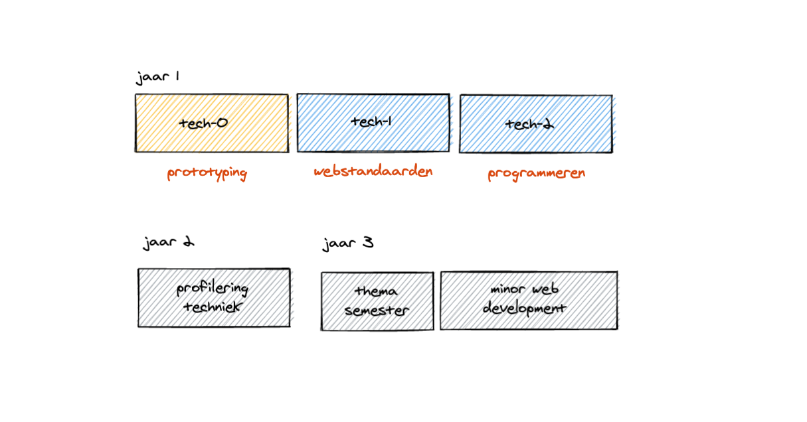
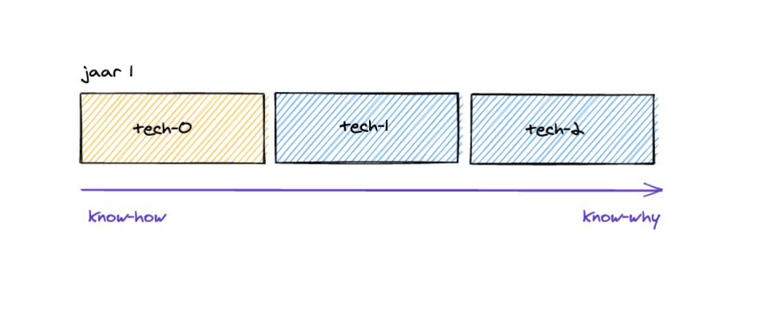
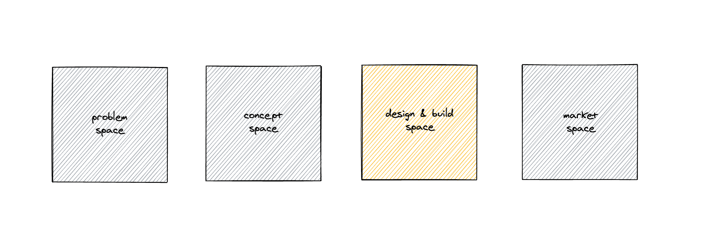
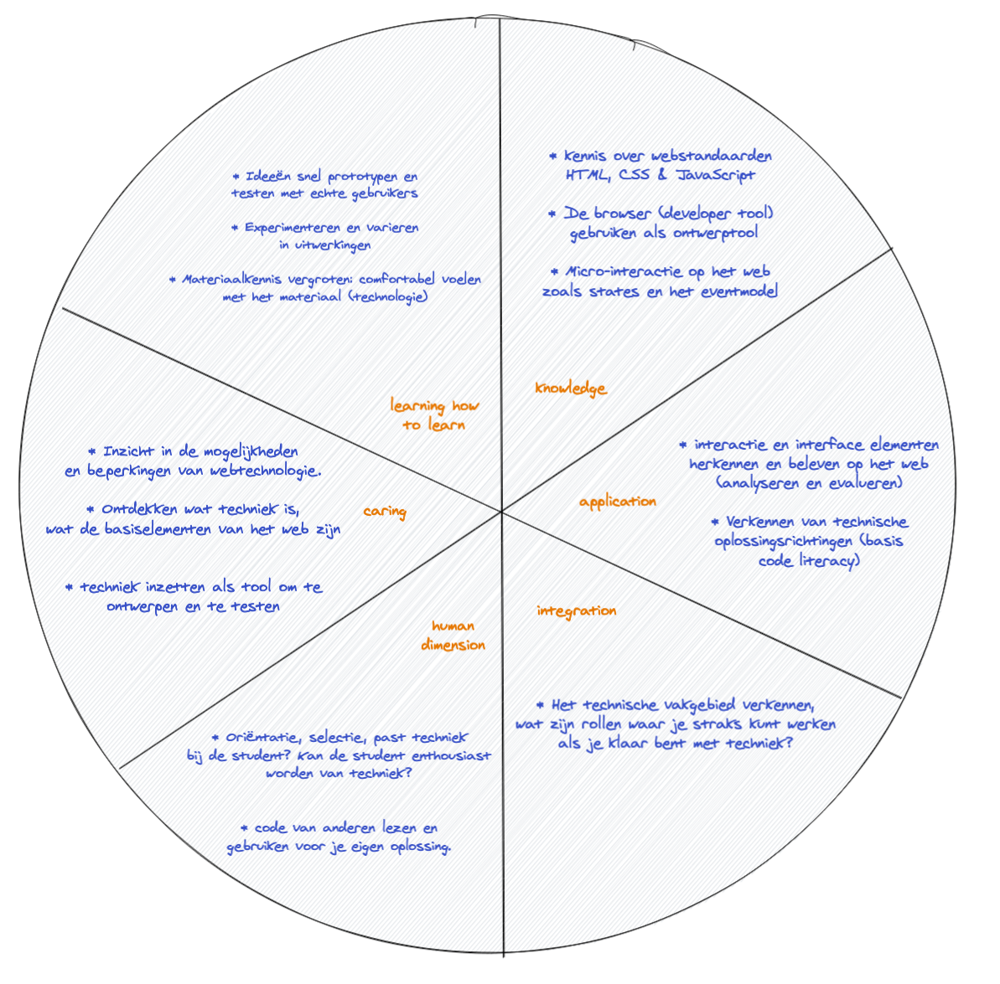
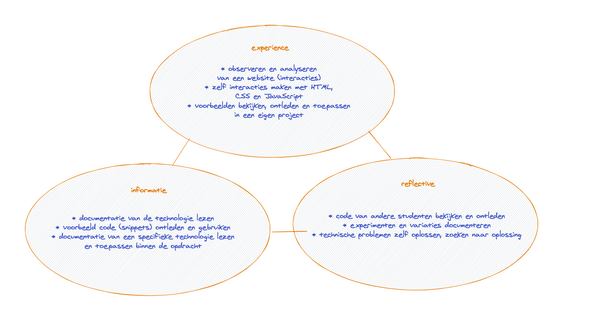
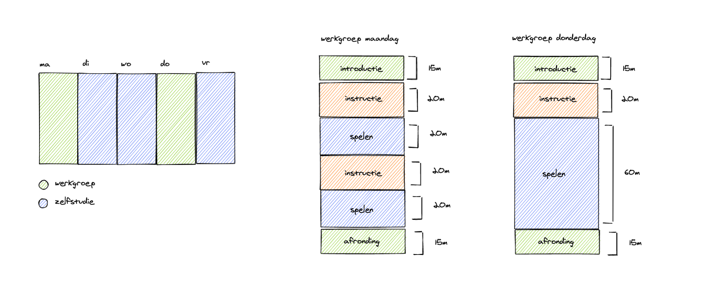
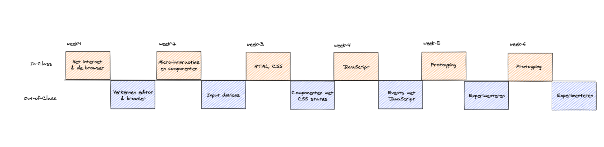
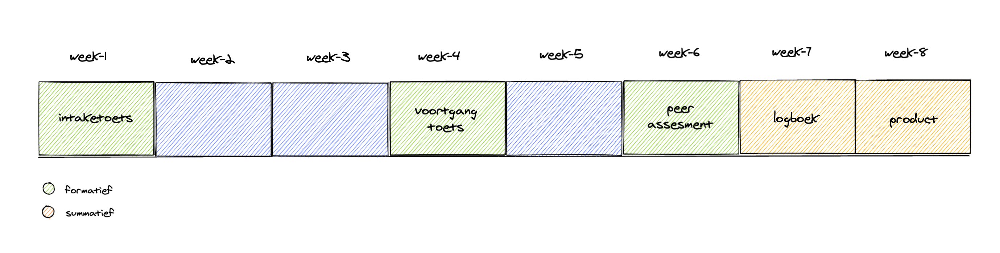

# Ontwerpopdracht Herontwerp

## Metadata

- Cursus: Basiskwalificatie Didactische Bekwaamheid (BDB)
- Docent: Danny de Vries (Docent Webtechnologie)
- Jaar: Feb - Jun 2020
- Universeit: Hogeschool van Amsterdam (HvA Academie)
- Opleiding: Communication and Multimedia Design (voltijd CROHO: 34092)
- Faculteit: Digital Media and Creative Industries
- Leergroep: De Zwarte Piste

## Inhoudsopgave

- [Introductie](#introductie)
- [Verbeterpunten](#verbeterpunten)
- [Situational Factors](#situational-factors)
- [Leerdoelen](#leerdoelen)
- [Leeractiviteiten](#leeractiviteiten)
- [Toetsing](#toetsing)
- [Alignment](#alignment)
- [Leeromgeving](#leeromgeving)
- [Feedback](#feedback)
- [Bronnen](#bronnen)
- [Bijlage](#bijlage)

## Introductie

Bij CMD amsterdam zijn we het fundament aan het herontwerpen voor studiejaar 20/21, een grote curriculumvernieuwing voor de propedeuse. Onze curriculumcommisie overziet dit herontwerp en neemt vooral de organisatorische taak op zich. **Aan mij is door de curriculumcomissie gevraagd om vorm te geven aan het vak `tech-0`, het allereerste technische vak binnen onze opleiding**. Het vak `tech-0` gaat enigszins een vervangingen worden van de huidige technische vakken die we nu in de propedeuse hebben, activiteiten en vakinhoud behouden wat nog relevant is maar in principe mag het vak 'op de schop' (zie analyse voor meer achtergrondinfo).

`tech-0` gaat een _verplicht studieonderdeel_ zijn voor elke propedeuse student (3 ECTS). Er zullen 4 clusters zijn met elk ongeveer ~5 klassen, dit vak heeft dus in totaal 20 klassen en voor elk cluster een aparte module coördinatoren (4 in totaal). Het nieuwe vak wordt in blok 1 van het studiejaar aangeboden en is het 'introductie vak' voor techniek van onze opleiding, de grande entree. De andere technische vakken (in de verdere verloop van het studiejaar) sluiten op dit vak aan en geven meer verdieping.

_Overzicht van alle technische vakken in het vernieuwde curriculum en de positie van tech-0. Volledige techlijn op CMD amsterdam._

_Know how versus know why._

**Het krachtige aan `tech-0` is dat dit voor veel studenten de eerste aanraking is met techniek**, websites programmeren in HTML, CSS & JavaScript. Je hebt als coördinator(en docent) eigenlijk vrij spel om deze studenten enthousiast te maken voor web technologie.

Positie van het vak `tech-0` binnen de huidige visie van CMD Amsterdam. Studenten werken hun concepten uit met web technologie, experimenteren met het materiaal in verschillende iteraties. De focus ligt op het uitwerken, niet op het concept, dat leren studenten bij de andere vakken.

_Positie van het vak in de project spaces van CMD amsterdam (CMD visie op ontwerpen 2019)._

_De opzet van dit document van dit herontwerp volgt de stappen van **intergrated course design** uit Creating Significant Learning Experiences van Dee Fink. Dit herontwerp is ook vooral de opzet van `tech-0` vak niet per se de vakinhoud._

**Uitgangspunten (wens):**

- Blijvende verandering met betrekking tot techniek en coderen in de verdere carriere van de student
- Voorbeelden op de praktijkgericht (resultaatgericht) die aansluiten bij het werkveld, maar ook kennis meegeven die in het werkveld vaak onderbelicht is.
- Vak waar ze inhoudelijk in hun loopbaan wat aan gaan hebben, techniek inzetten om hun ontwerp te realiseren.

## Verbeterpunten Analyse

Aan het eind van de analyse kwam ik tot de volgende verbeterpunten, onderstaande punten zijn de startpunten (uitgangspunten) voor mijn herontwerp:

**Een goede balans tussen _know-why_ en _know-what/how_**  
De huidige technische vakken gaan snel naar 'the big picture' en focust op het ontwikkelen van code literacy in plaats van resultaatgericht en meteen met code experimenteren. Dat betekend niet dat de 'know-why' onbelangrijk is maar de balans tussen deze twee uiterste kan beter.

**Het aansterken van formatieve toetsing en tussentijdse oplevering**  
Er is een (te grote) groep studenten die te laat 'echt' begint. Het gat van de tussenopdrachten in de les en de eindopdracht ervaren studenten als groot. De student moet op het eind een grote inspanning leveren en een docent heeft veel verwachting in de laatste weken. Een betere spreiding en eerder naar de eindopdracht toewerken zou een goede verbetering zijn. Dit kan wellicht door halverwege of op een meer systematische manier formatieve (of zelfs summatieve) toetsen af te nemen, zodat het voor een groep studenten een aanleiding is om halfweg al een grotere inspanning te leveren.

**De huidige technische vakken hebben een focus op cognitieve skills**  
De focus ligt op pogrammeertalen leren en toepassen in plaats van een bredere kijk op techniek met betrekking tot het bedrijfsleven en eigen ontwikkeling verder in de studie. In het vak moeten systematisch meer praktijkvoorbeelden komen, een relatie worden gelegd met de andere vakken binnen dat blok (of een duidelijkere koppeling naar een overkoepelend project) en de beroepspraktijk.

**Meer nadruk op blended learning (leerniveau's & out-of class activities)**  
Meer ruimte voor out-of class activities en blended learning. Thuis video's kijken, docenten die screencasts opnemen met live demo's. Studenten moeten meer hun eigen leerpad kunnen bepalen (indelen op niveau). Meer aandacht voor studenten die het een en ander al weten, uitdagende opdrachten geven en als docent meedenken over persoonlijke leerdoelen.

**Studenten enthousiasmeren en laten spelen (klooien) met techniek**  
Het is lastig om non-techies aan het prototypen te krijgen met techniek, maar misschien is dit ook onhaalbaar. Het echt 'programmeren' moet meer verplaats worden naar latere jaar, aansluitende vakken aan `tech-0` of de profilering techniek in het tweede jaar en 'enthousiasme' voor prototype en technologie naar de propedeuse. Het is vaak taaie technische stof en studenten zien niet de mogelijkheden van web technologie. Dit resulteerd wellicht in minder 'skills' aan het eind van de propedeuse maar gedurende de langere leerlijn van het curriculum heeft dit wellicht het gewenste effect namelijk enthousiasme voor techniek.'

## Situational Factors

> De situational factors en hoe deze worden beinvloedt voor het herontwerp.

- **Context of learning situation:** In totaal zullen er dus ~20 klassen zijn met elk 25 studenten. In een week zijn er twee werkgroepen van elk 3 lesuren, het liefst aan het begin van de week (op maandag) en verder in de week (op donderdag) zodat studenten in een flow kunnen komen. Het zullen voornamelijk grote klassen zijn (25/30) waardoor het voor docenten lastig is iedereen individueel aandacht te geven. Juist omdat je bij dit vak extra ruimte wilt nemen om studenten die het ‘zwaar’ hebben extra te motiveren. Door kortere lessen met kleinere lesuren forceer je studenten enigszins zich beter voor te bereiden omdat de lestijd wat korter is.
- **Expectations of External groups:** Op CMD Amsterdam leiden we multidisciplinaire ontwerpers op (T-Shaped designers), oftewel studenten komen in aanraking met verschillende rollen. We verwachten dus dat ondanks een student zich wellicht niet wilt profileren in techniek, elke student een basis heeft om techniek in te zetten of in ieder geval te communiceren met techneuten. Ook vanuit het bedrijfsleven is er steeds meer vraag naar studenten die zowel vormgeving (visual) en techniek (development) kunnen combineren. _Beinvloeden door: praktijkvoorbeelden laten zien, experimentele creative (coding) voorbeelden. Interactie op het web._
- **Nature of the Subject:** Techniek is constant aan het veranderen, vooral de tooling om techniek heen maar de basis programmeertalen voor het web (HTML, CSS & JavaScript, het fundament) is al vele jaren hetzelfde. Deze fundamentele talen zijn ook het uitgangspunt van dit vak. Alle tooling hieromheen is voor latere jaren. Naast het leren van programmeertalen (cognitie) gaat programmeren ook over probleem oplossend vermogen, bronnen op waarde schatten, documentatie lezen en experimenteren met oplossingen en mogelijkheden. _Beinvloeden door: live demo's (problemen oplossen en fouten maken), verscheidenheid van bronnen, documentatie lezen._
- **Characteristics of the learners:** Niveau verschil binnen een klas, verschil tussen voor ervaring (vooropleiding, programmeren op middelbare school). CMD zijn visuele (creative) studenten dus veel uitkomst van code laten zien, show don't tell. Verder verplicht vak, wel of geen aanleg tot techniek. _Beinvloeden door: in-take toetsjes, leerlevels, verscheidenheid in bronnen (video's, documentatie, abstracte boeken vs explainer artikelen)_
- **Characteristics of the teacher:** Enthousiasme van docent, passie voor het vak. Of de docent het in begrijpelijk taal kan uitleggen, enthousiasme en passie heeft voor programmeren en of de docent bereikbaar is buiten de les heeft grote impact op het slagen van de student. Vooral curse of knowledge is een probleem. Oud studenten die ook CMD hebben kunnen zich goed verplaatsen in studenten. Veel docenten die al wat langer op CMD werken geven les in P. Positief en negatief punt? _Beinvloeden door: voorbeelden laten aandragen door docenten?, veel concepten in diagrammen uitschrijven in slides?_

## Leerdoelen

> De leerdoelen in het nieuwe nieuwe ontwerp volgens de taxonomie van Dee Fink.

In grote lijnen zijn de overkoepelende doelen voor `tech-0`:'

1. **Materiaalkennis vergroten:** spelen en experimenteren met web techologie.
2. Een een **basis code literacy** ontwikkelen.
3. **Herkennen en beleven** van interactie op het web.
4. **Inzicht krijgen in de mogelijkheden** van web technologie

_Over een paar jaar, nadat dit vak is afgelopen wil ik dat studenten **techniek als ontwerptool kunnen inzetten.**_ Op basis van deze visie heb ik een hele lijst met uigangspunten voor dit vak geschreven en de in de taxonomy of significant learning geplaatst met het idee om deze vervolgens tot in meer detail uit te schrijven tot 5/6 concrete leerdoelen.

_Taxonomy of Significant Learning Goals voor tech-0._

Op basis van deze uitgangspunten kom ik tot de volgende leerdoelen:

| Leerdoel                                                          | Taxonomie     |
| ----------------------------------------------------------------- | ------------- |
| Je hebt basiskennis over hoe een website en het internet werkt    | Remembering   |
| Je begrijpt de rol van web technologie als ontwerper              | Understanding |
| Je kan spelen en experimenteren met web technologie               | Applying      |
| Je snapt de mogelijkheden en beperkingen van web technologie      | Evaluating    |
| Je maakt een interactief prototype met behulp van web technologie | Creating      |

Op basis van de BokSA die binnen de tech-expertise groep is gemaakt kom ik tot de volgende subleerdoelen die iets dieper ingaan op de vakinhoud:

| Subleerdoelen                                                                              |
| ------------------------------------------------------------------------------------------ |
| Je kent de basis van webstandaarden zoals HTML, CSS & JavaScript                           |
| Je kunt een rapid prototype online zetten en je interacties testen met gebruikers          |
| Je kunt de browser en developer tools inzetten als ontwerptool om je website te analyseren |
| Je kunt een proof of concept (ontwerp) met interacties omzetten in werkende code           |
| Je kunt code van anderen lezen en gebruiken voor je eigen oplossing                        |
| Je verkent meerdere mogelijkheden en vergelijkt technische oplossingen                     |

Verder sluit `tech-0` aan bij **Begrijpen en kaderen** (analyseren), **Conceptualiseren** (synthetiseren), **Verbeelden en maken** (concretiseren) en **Onderzoeken** (reflecteren) als CMD Competenties.

Voor deze leerdoelen en subleerdoelen worden in de volgende sectie leeractiviteiten en vervolgens aansluitende toetsing gemaakt.

## Leeractiviteiten

> Leer- en docentactiviteiten die passen bij de leerdoelen en bij de toetsing.

De werkgroepen zijn zoveel mogelijk opgezet om studenten **actief te laten leren**. Na een korte ondersteunende instructie gaan studenten actief met die stof aan de slag in de vorm van een opdracht. Verdere uitgangspunten voor activiteiten zijn:

- Snel, fun en trots: **resultaatgericht**. Na een les hebben studenten meteen opdrachten gemaakt die ze met trots aan papa en mama kunnen laten zien. Het resultaat zou in eerste instantie misschien wel belangrijker moeten zijn dan de daadwerkelijk geschreven code.
- Het leren moet het resultaat zijn van het **oplossen van een probleem.** Een technische uitdaging kunnen ontleden, de student moet stapsgewijs denken (pseudocode).
- **Herkennen en beleven** van interactie op het web. Inzicht krijgen in de mogelijkheden van web technologie en technische haalbaarheid van een ontwerp.
- **Experimenteren en varieren** in de uitwerking van de opdrachten. Meerdere mogelijkheden hebben onderzocht en uitgewerkt en daarop reflecteren en keuzes.

_Actief leren diagram met mogelijke interventies._

Hierna ben ik aan de slag gegaan met een weekopzet en een lesopzet ook om proberen de structuur en de flow van de studenten te visualiseren. Binnen een les probeer ik zoveel mogelijk de _bouwstenen van effectieve didactiek_ te verwerken.

_Opzet van de week inclusief werkgroepen._

De vakinhoud is gebasseerd op de BoKSA (Body of Knowledge and Skills) die is opgesteld door de tech-expertise groep. Studenten kunnen in een flow komen door thema’s per week, daarbij aansluitende opdrachten, directe feedback op die opdrachten en de formatieve toetsmomenten als mijlpalen. Door de formatieve momenten bouw je een soort 'check in' waarbij je het werk waar de studenten naartoe werk kunt bijsturen.

_In and out of class activities._

Alle blauwe vlakken (out-of-class) zijn resources (screencasts, video's en opdrachten) die studenten zelfstandig kunnen uitvoeren waarbij we vervolgens in een werkgroep de resultaten klassikaal kunnen bespreken. De meeste opdrachten wil ik asynchroon gaan aanbieden om vervolgens naar inde les instructie of feedback op te geven. De out-of-class activities zijn ook een goed moment om leerniveau's in te zetten, door in verschillende pistes de bronnen en video's in te delen.

- Week 1: Opening, leuke opdracht introductie web technologie. Voorbeelden uit praktijk laten zien. (forward-looking). Uitleg over het vak en de beoordeling. Duidelijk maken wat tot een voldoende lijdt. (criteria and standards). In deze week ook de in-take toets om het niveau van de student te bepalen (leerlevel /pistes).
- Week 2/5: Formatieve toetsing, tussenopdrachten en voortgang elke week tussentijds inleveren in leeromgeving en als docent FIDelity feedback geven. Monitoren van voortgang en directe feedback terugkoppelen zodat studenten in een flow kunnen komen.
- Week 6/7: Self-assesments (peer review) zichzelf en elkaar beoordelen en reflecteren op eigen werk en progressie gedurende het vak. Het leren beoordelen van eigen werk is een doel binnen het hoger onderwijs.
- Week 8: Eindbeoordelingen en summatief beoordelingsmoment.

## Toetsing

> Toetsing en assessment die passen bij de leerdoelen aan de hand van de toetscyclus.

Als uitgangspunt wil ik binnen het vak meer op **vaardigheden toetsen dan op kennis**. `tech-0` blijft in dat opzich wel een kennisvak omdat het in het fundament (propedeuse) van onze opleiding zit en dus vooral op onthouden, begrijpen en toepassen zitten binnen de taxonomie van Bloom. HBO studenten willen denk ik meer uit de praktijk leren, misschien minder uit de theorie. Dus vanuit toepassen vertrekken en dan theorie eraan koppelen of deze later bij de andere technische vakken terug laten komen.

Voor _summatieve toetsen_ wil ik twee toetsvormen gebruiken:

1. Studenten coderen een _website met micro-interacties_ als **product (praktijkopdracht)** en die met een _mondelings toets_ aan de hand van een _Rubric_ beoordelen met een _becijfering_ aan het eind van het vak. Mijn idee is wel om de studenten veel autonomie te geven over de invulling van de opdracht. Ik wil dat studenten de kans krijgen om te ontdekken, onderzoeken en leren om problemen aan te pakken en daarmee op hun eigen manier aan de leerdoelen kunnen voldoen.
2. Studenten houden gedurende het vak een _logboek (productbiografie)_ bij over de theorie van _web & wereld_ en leveren deze aan het eind van het vak in. Dit logboek is denk ik een combinatie van een **kennistoets en reflectieopdracht**. Deze wordt beoordeeld met _o/m/v/g/_.

Omdat de focus ligt op vaardigheden en niet op kennis wil ik de weging van het product 70% maken en het logboek voor 30% laten meetellen. De onderdelen zijn niet compenseerbaar omdat beide belangrijk zijn om aan alle leerdoelen te voldoen.

- Product: 70% weging
- Logboek: 30% weging
- Compenseerbaar: Nee (beide minimaal een voldoende)
- Het eindcijfer van de onderwijseenheid is het gemiddelde van deze voldoendes.

Daarnaast wil ik twee toetsvormen gebruiken voor formatieve toetsing gedurende het vak.

1. Een **intaketoets (feedback)** aan het begin van het vak om het beginniveau van de student te bepalen en de student aan de hand daarvan in te delen in een leerniveau.
2. Op de helft van het week een formatief **voortangstoets (feedup)** om studenten te pushen om tussentijds al een grote inspanning te leveren voor het product aan het eind.
3. Gedurende het eind van het vak een **peer assessment (feedforward)** inzetten voor het product waarbij studenten zichzelf en eventueel elkaar beoordelen aan de hand van het beoordelingsformulier. Het eindcijfer mag wat mij betreft nooit tot een verassing komen.

Deze momenten wil ik niet becijferen en dus ook niet laten meewegen in het cijfer. Wel wil ik hier verplichte onderdelen (aan voorwaarde voldaan) van maken die studenten moeten afronden met een _niet voldaan/voldaan_. De valkuil van het niet becijferen is dat je veel aan het nakijken bent en dan aan het eind nog eens als summatieve toets. Misschien moeten de formatieve toetsen toch enige weging hebben in het eindcijfer van het vak.

De toetsing voor het vak zou er in een schematische weergave zo uitzien:

_Schematische weergave formatieve en summatieve toetsmomenten (toetsprogramma)._

Ik probeer hier dus ook verschillende toetsvormen te combineren, niet 1 methode kan alles doen maar samen worden ze krachtig.

Het logboek gaat hier dus vooral over onthouden en begrijpen binnen de taxonomie van Bloom en het product gaat meer naar deep level learning waarbij studenten de stof moeten toepassen in hun eigen website (product), analyseren en evalueren over hun gemaakte werk en progressie. Product en logboek (assessment) is meer affectief en het logboek is meer cognitief.

De formatieve momenten gaan over de tussenstappen, het leren activeren en leren van dat toetsmoment. In de laatste weken zijn dus de summatieve toetsen, dan eindigt het leren.

De uiteindelijke beoordelingen zijn dus vooral **criteriumgericht**. De student toont met de toets aan de hand van een rubric aan in welke mate deze criteria (leerdoelen) zijn behaald. Aan de hand van de intaketoets en de self-assessment aan het einde van de toets zie ik ook nog een kans om ipsatief te toetsen maar wat de precieze invullen zou zijn vind ik moeilijk uit te werken. Wat ik verder nog lastig vind is (waarschijnlijk werkvormen) vinden waar studenten actief met de feedback aan de slag gaan. Studenten moeten feedback om kunnen zetten in acties en kunnen aangeven waar ze feedback op willen ontvangen. De ontvanger (student) moet actief wat met de feedback doen.

**Kwaliteitscriteria:**

- Validiteit: Ik heb er geen twijfel over dat alle docenten (examinator) de producten op vakinhoudelijk niveau kunnne beoordelen. Er zijn heldere en duidelijke beoordelingschaling, voor docenten voeg ik cesuur en norm bepaling toe in de vorm van: voldoende of onvoldoende. Tijdens het vak moet er de mogelijkheid zijn om onderling te callibreren.
- Betrouwbaarheid: Beide summatieve toetsvormen hebben een beoordelingsinstrument (rubric) die de beoordelingscriteria bevatten. In een rubric is het over het algemeen heel helder wat de score is voor een voldoende en daarmee ook de cesuur bepaling voor docenten. De rubric geeft ook ruimte voor feedback (eventuele ophoging van het cijfer).
- Transparantie: De leerdoelen zijn omgezet naar beoordelingscriteria die duidelijk maakt wanneer de opdracht voldoende of onvoldoende is. Al deze rubrics worden in de les besproken, staan op de leeromgeving. Naast vakinhoudelijke criteria staan er ook formele eisen (vorm) op (AVV's).
- Leerfunctie: De formatieve toetsmomenten (intake, voortgang en self-assessment) hebben allen een leerfunctie, ze dienen tevens als feedback moment en de student kan op basis van die momenten het product aanpassen en de feedback verwerken.

**Rubrics:**  
Voor beide summatieve toetsen wil ik gebruik maken van een **rubric** om de onderdelen te beoordelen vanwege de volgende redenen:

- Transparent voor studenten etc.
- Vierpuntsschaal, waarbij eerst de voldoende is uitgewerkt. Prestatie beschreven in 1 zin. En dan van o/v/g/zg. Ik denk dat de matig niet zo heel zinnig is al kan dat wel een manier zijn om een 'net niet' aan te geven. Een matig heeft misschien meer een leer/ verbeterfunctie dan een harde onvoldoende. Onvoldoende kan meer een 'nog niet' worden.

Alle het gemaakte werk (toetsvormen) worden digitaal ingeleverd in de upload-omgeving van Brightspace. De leeromgeving wordt gebruikt als omgeving voor feedback, analyse, beoordeling en archiveringstool.

_De opzet van de toetsen volgt de stappen van **de toetscyclus** op score.hva.nl_

## Alignment

> Check of alle componenten (leerdoelen, toets en leeractiviteiten) verbonden en geïntegreerd zijn

## Leeromgeving

> De nieuwe studiehandleiding en/of de communicatie naar studenten. Playground, inrichting DLO etc.

## Feedback

#### Onderwijskundige

> Haal feedback op van in ieder geval: een SKE-er van jouw opleiding en nogmaals van de onderwijskundige van jouw faculteit op het herontwerp. Een mooie aanvulling is om feedback van collega-docenten, opleidingsmanager en/of van studenten op het nieuwe ontwerp vragen.

#### SKE'er opleiding

> In je kluis is straks duidelijk het feedbackformulier terug te vinden van je SKE-er. (Checklist SKE)

#### Team (inclusief je werkplekbegeleider)

> Het herontwerp presenteer je in een bijeenkomst op je eigen opleiding. Het resultaat van deze opdracht is je presentatie en de reactie daarop van de aanwezigen bij die presentatie.

#### Leergroep

> Spreek af met jouw leergroep en help elkaar

## Bronnen

- [BKE Module: Toestcyclus. (score.hva.nl)][bke]
- [Kennisclip: Waarom een toetsmatrijs? (score.hva.nl)][wet]
- [Kennisclip: Rubrics for Assessments? (score.hva.nl)][rfa]
- [Paul van den Bos (2016). Toetsen om te leren. (geannoteerd)](#)
- [Margo van Rotterdam. Kennisclip Constructive Alignment.](#)
- [Cees van der Vleuten. Programmatisch toetsen. (score.hva.nl)](#)
- [Veronica Bruijns. Ontwikkelingen op toetsgebied. (score.hva.nl)](#)

## Bijlagen

[bke]: https://score.hva.nl/bke/Paginas/default.aspx
[rfa]: https://www.youtube.com/watch?v=8EwPlTQzSLM
[wet]: https://www.youtube.com/watch?v=kp3rANE8z6s
