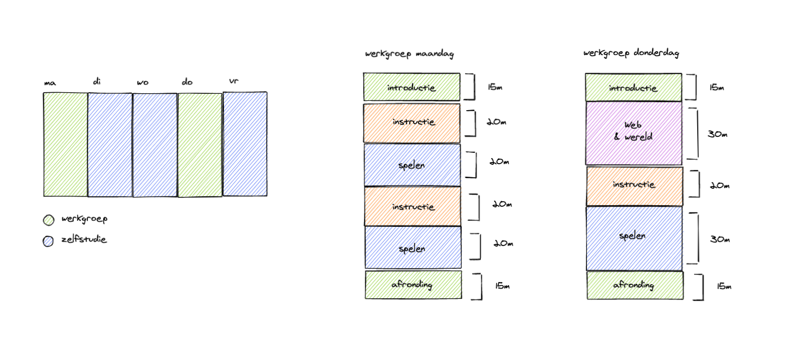

# Ontwerpopdracht Herontwerp

## Metadata

- Cursus: Basiskwalificatie Didactische Bekwaamheid (BDB)
- Docent: Danny de Vries (Docent Webtechnologie)
- Jaar: Feb - Jun 2020
- Universeit: Hogeschool van Amsterdam (HvA Academie)
- Opleiding: Communication and Multimedia Design (voltijd CROHO: 34092)
- Faculteit: Digital Media and Creative Industries
- Leergroep: De Zwarte Piste

## Inhoudsopgave

- [Introductie](#introductie)
- [Verbeterpunten](#verbeterpunten)
- [Situational Factors](#situational-factors)
- [Leerdoelen](#leerdoelen)
- [Leeractiviteiten](#leeractiviteiten)
- [Leeromgeving](#leeromgeving)
- [Toetsing](#toetsing)
- [Alignment](#alignment)
- [Deliverables](#deliverables)
- [Feedback](#feedback)
- [Bronnen](#bronnen)
- [Bijlage](#bijlage)

## Introductie

Bij CMD amsterdam zijn we het fundament aan het herontwerpen voor studiejaar 20/21, een grote curriculumvernieuwing voor de propedeuse. Onze curriculumcommisie overziet dit herontwerp en neemt vooral de organisatorische taak op zich. **Aan mij is door de curriculumcomissie gevraagd om vorm te geven aan het vak `tech-0`, het allereerste technische vak binnen onze opleiding**. Het vak `tech-0` gaat enigszins een vervangingen worden van de huidige technische vakken die we nu in de propedeuse hebben, activiteiten en vakinhoud behouden wat nog relevant is maar in principe mag het vak 'op de schop' (zie analyse voor meer achtergrondinfo).

`tech-0` gaat een _verplicht studieonderdeel_ zijn voor elke propedeuse student (3 ECTS). Er zullen 4 clusters zijn met elk ongeveer ~5 klassen, dit vak heeft dus in totaal 20 klassen en voor elk cluster een aparte module coördinatoren (4 in totaal). Het nieuwe vak wordt in blok 1 van het studiejaar aangeboden en is het 'introductie vak' voor techniek van onze opleiding, de grande entree. De andere technische vakken (in de verdere verloop van het studiejaar) sluiten op dit vak aan en geven meer verdieping.

_Overzicht van alle technische vakken in het vernieuwde curriculum en de positie van tech-0. Volledige techlijn op CMD amsterdam._

_Know how versus know why._

**Het krachtige aan `tech-0` is dat dit voor veel studenten de eerste aanraking is met techniek**, websites programmeren in HTML, CSS & JavaScript. Je hebt als coördinator(en docent) eigenlijk vrij spel om deze studenten enthousiast te maken voor web technologie.

Positie van het vak `tech-0` binnen de huidige visie van CMD Amsterdam. Studenten werken hun concepten uit met web technologie, experimenteren met het materiaal in verschillende iteraties. De focus ligt op het uitwerken, niet op het concept, dat leren studenten bij de andere vakken.

_Positie van het vak in de project spaces van CMD amsterdam (CMD visie op ontwerpen 2019)._

_De opzet van dit document van dit herontwerp volgt de stappen van **intergrated course design** uit Creating Significant Learning Experiences van Dee Fink._

## Verbeterpunten Analyse

Aan het eind van de analyse kwam ik tot de volgende verbeterpunten, onderstaande punten zijn de startpunten (uitgangspunten) voor mijn herontwerp:

**Een goede balans tussen _know-why_ en _know-what/how_**  
De huidige technische vakken gaan snel naar 'the big picture' en focust op het ontwikkelen van code literacy in plaats van resultaatgericht en meteen met code experimenteren. Dat betekend niet dat de 'know-why' onbelangrijk is maar de balans tussen deze twee uiterste kan beter.

**Het aansterken van formatieve toetsing en tussentijdse oplevering**  
Er is een (te grote) groep studenten die te laat 'echt' begint. Het gat van de tussenopdrachten in de les en de eindopdracht ervaren studenten als groot. De student moet op het eind een grote inspanning leveren en een docent heeft veel verwachting in de laatste weken. Een betere spreiding en eerder naar de eindopdracht toewerken zou een goede verbetering zijn. Dit kan wellicht door halverwege of op een meer systematische manier formatieve (of zelfs summatieve) toetsen af te nemen, zodat het voor een groep studenten een aanleiding is om halfweg al een grotere inspanning te leveren.

**De huidige technische vakken hebben een focus op cognitieve skills**  
De focus ligt op pogrammeertalen leren en toepassen in plaats van een bredere kijk op techniek met betrekking tot het bedrijfsleven en eigen ontwikkeling verder in de studie. In het vak moeten systematisch meer praktijkvoorbeelden komen, een relatie worden gelegd met de andere vakken binnen dat blok (of een duidelijkere koppeling naar een overkoepelend project) en de beroepspraktijk.

**Meer nadruk op blended learning (leerniveau's & out-of class activities)**  
Meer ruimte voor out-of class activities en blended learning. Thuis video's kijken, docenten die screencasts opnemen met live demo's. Studenten moeten meer hun eigen leerpad kunnen bepalen (indelen op niveau). Meer aandacht voor studenten die het een en ander al weten, uitdagende opdrachten geven en als docent meedenken over persoonlijke leerdoelen.

**Studenten enthousiasmeren en laten spelen (klooien) met techniek**  
Het is lastig om non-techies aan het prototypen te krijgen met techniek, maar misschien is dit ook onhaalbaar. Het echt 'programmeren' moet meer verplaats worden naar latere jaar, aansluitende vakken aan `tech-0` of de profilering techniek in het tweede jaar en 'enthousiasme' voor prototype en technologie naar de propedeuse. Het is vaak taaie technische stof en studenten zien niet de mogelijkheden van web technologie. Dit resulteerd wellicht in minder 'skills' aan het eind van de propedeuse maar gedurende de langere leerlijn van het curriculum heeft dit wellicht het gewenste effect namelijk enthousiasme voor techniek.

## Situational Factors

- **Context of learning situation:** In totaal zullen er dus ~20 klassen zijn met elk 25 studenten. In een week zijn er twee werkgroepen van elk 3 lesuren, het liefst aan het begin van de week (op maandag) en verder in de week (op donderdag) zodat studenten in een flow kunnen komen. Het zullen voornamelijk grote klassen zijn (25/30) waardoor het voor docenten lastig is iedereen individueel aandacht te geven. Juist omdat je bij dit vak extra ruimte wilt nemen om studenten die het ‘zwaar’ hebben extra te motiveren. Door kortere lessen met kleinere lesuren forceer je studenten enigszins zich beter voor te bereiden omdat de lestijd wat korter is.
- **Expectations of External groups:** Op CMD Amsterdam leiden we multidisciplinaire ontwerpers op (T-Shaped designers), oftewel studenten komen in aanraking met verschillende rollen. We verwachten dus dat ondanks een student zich wellicht niet wilt profileren in techniek, elke student een basis heeft om techniek in te zetten of in ieder geval te communiceren met techneuten. Ook vanuit het bedrijfsleven is er steeds meer vraag naar studenten die zowel vormgeving (visual) en techniek (development) kunnen combineren. _Beinvloeden door: praktijkvoorbeelden laten zien, experimentele creative (coding) voorbeelden. Interactie op het web._
- **Nature of the Subject:** Techniek is constant aan het veranderen, vooral de tooling om techniek heen maar de basis programmeertalen voor het web (HTML, CSS & JavaScript, het fundament) is al vele jaren hetzelfde. Deze fundamentele talen zijn ook het uitgangspunt van dit vak. Alle tooling hieromheen is voor latere jaren. Naast het leren van programmeertalen (cognitie) gaat programmeren ook over probleem oplossend vermogen, bronnen op waarde schatten, documentatie lezen en experimenteren met oplossingen en mogelijkheden. _Beinvloeden door: live demo's (problemen oplossen en fouten maken), verscheidenheid van bronnen, documentatie lezen._
- **Characteristics of the learners:** Niveau verschil binnen een klas, verschil tussen voor ervaring (vooropleiding, programmeren op middelbare school). CMD zijn visuele (creative) studenten dus veel uitkomst van code laten zien, show don't tell. Verder verplicht vak, wel of geen aanleg tot techniek. _Beinvloeden door: in-take toetsjes, leerlevels, verscheidenheid in bronnen (video's, documentatie, abstracte boeken vs explainer artikelen)_
- **Characteristics of the teacher:** Enthousiasme van docent, passie voor het vak. Of de docent het in begrijpelijk taal kan uitleggen, enthousiasme en passie heeft voor programmeren en of de docent bereikbaar is buiten de les heeft grote impact op het slagen van de student. Vooral curse of knowledge is een probleem. Oud studenten die ook CMD hebben kunnen zich goed verplaatsen in studenten. Veel docenten die al wat langer op CMD werken geven les in P. Positief en negatief punt? _Beinvloeden door: voorbeelden laten aandragen door docenten?, veel concepten in diagrammen uitschrijven in slides?_

## Leerdoelen

> De leerdoelen in dit nieuwe ontwerp. Gebruik daarvoor de taxonomie van Dee Fink of van Bloom.

## Leeractiviteiten

> Leer- en docentactiviteiten die passen bij de leerdoelen en bij de toetsing en bij het gewenste niveau van leren (diepte of oppervlakte). Je moet het herontwerp kunnen uitleggen gebaseerd op Constructive Alignment.

_Opzet van de week inclusief werkgroepen._

Eerst les een check-in om leerlevel te bepalen (pistes).

De vakinhoud is gebasseerd op de BoKSA (Body of Knowledge and Skills) die is opgesteld door de tech-expertise groep.

Thema's web & wereld:

- Toegankelijkheid
- Ethiek
- Privacy
- Bedrijfsleven / budget agency wereld

## Leeromgeving

> De nieuwe studiehandleiding en/of de communicatie naar studenten. Playground, inrichting DLO etc.

## Toetsing

> Een toets of assessment die past bij de leerdoelen. Onderbouw aan de hand van de toetscyclus. Laat zien dat de toets aanzet tot leren.

_De opzet van de toetsen volgt de stappen van **de toetscyclus** op score.hva.nl_

## Alignment

> Key components of intergrated course design. Model met pijlen aangeven wat er verbeterd is.

## Deliverables

> Linken naar de studiegids tekst, class website etc.

## Feedback

#### Onderwijskundige

> Haal feedback op van in ieder geval: een SKE-er van jouw opleiding en nogmaals van de onderwijskundige van jouw faculteit op het herontwerp. Een mooie aanvulling is om feedback van collega-docenten, opleidingsmanager en/of van studenten op het nieuwe ontwerp vragen.

#### SKE'er opleiding

> In je kluis is straks duidelijk het feedbackformulier terug te vinden van je SKE-er. (Checklist SKE)

#### Team (inclusief je werkplekbegeleider)

> Het herontwerp presenteer je in een bijeenkomst op je eigen opleiding. Het resultaat van deze opdracht is je presentatie en de reactie daarop van de aanwezigen bij die presentatie.

#### Leergroep

> Spreek af met jouw leergroep en help elkaar

## Bronnen

- [BKE Module: Toestcyclus. (score.hva.nl)][bke]
- [Kennisclip: Waarom een toetsmatrijs? (score.hva.nl)][wet]
- [Kennisclip: Rubrics for Assessments? (score.hva.nl)][rfa]

## Bijlagen

[bke]: https://score.hva.nl/bke/Paginas/default.aspx
[rfa]: https://www.youtube.com/watch?v=8EwPlTQzSLM
[wet]: https://www.youtube.com/watch?v=kp3rANE8z6s
